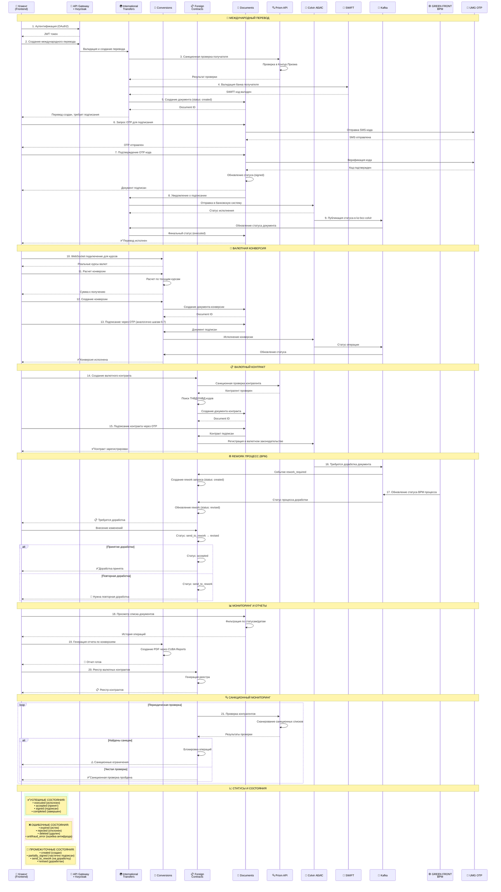
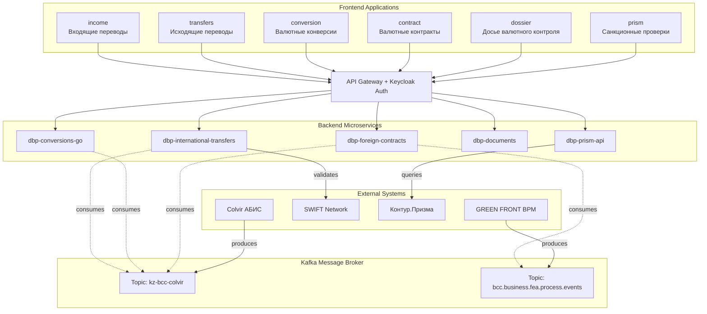
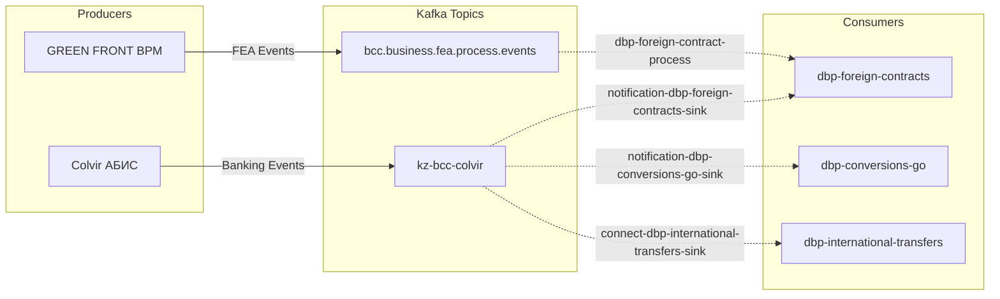
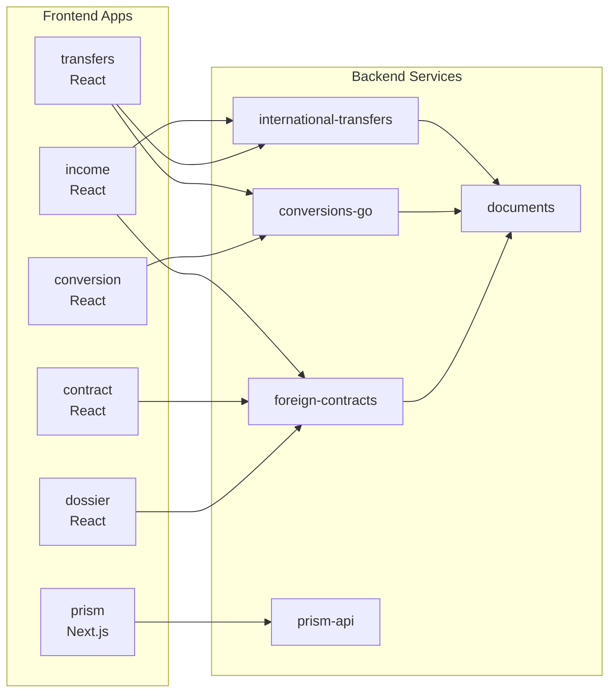
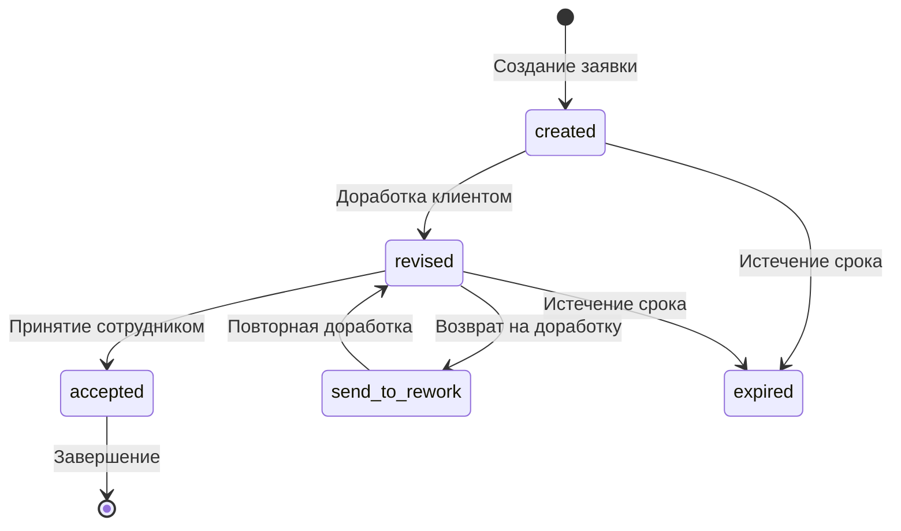
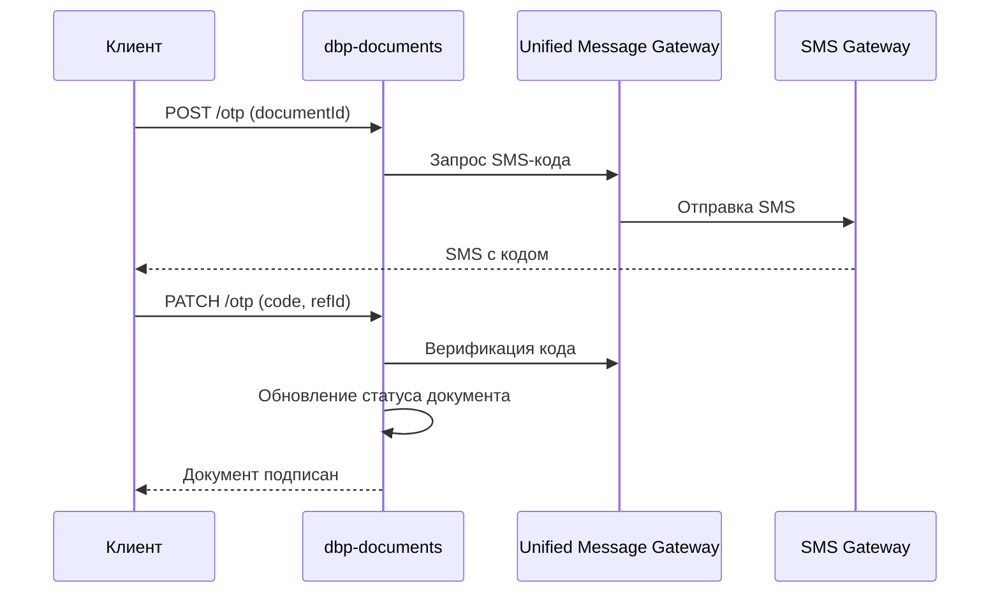

# Платформа цифрового банкинга - Backend микросервисы

## Обзор проекта

**Digital Banking Platform (DBP)** - это современная микросервисная архитектура для цифрового банкинга, разработанная на Go. Платформа обеспечивает полный спектр банковских услуг включая международные переводы, валютные операции, управление контрактами и документооборот.

## 🔄 Общий бизнес-флоу всех процессов

### Sequence диаграмма: Полный жизненный цикл банковских операций



### 🎯 Ключевые точки интеграции

1. **Аутентификация**: Все запросы проходят через Keycloak OAuth2
2. **Санкционный контроль**: PRISM проверки на каждом этапе
3. **Подписание**: Унифицированная OTP система через SMS
4. **Исполнение**: Все операции проходят через Colvir АБИС
5. **Уведомления**: Kafka обеспечивает асинхронную обработку событий
6. **BPM процессы**: GREEN FRONT управляет сложными бизнес-процессами

### 📋 Финальные статусы операций

| Тип операции | Успешный статус | Промежуточные | Ошибочные |
|--------------|----------------|---------------|-----------|
| **Международный перевод** | `executed` | `created`, `signed` | `expired`, `antifraud_error` |
| **Валютная конверсия** | `executed` | `created`, `signed` | `expired`, `rejected` |
| **Валютный контракт** | `accepted` | `created`, `signed` | `expired`, `rejected` |
| **Rework процесс** | `accepted` | `revised`, `send_to_rework` | `expired`, `rejected` |
| **Подтверждающий документ** | `completed` | `created`, `partially_signed` | `expired`, `deleted` |

## Архитектура системы



### Потоки данных в системе

**Frontend → Backend связи:**
- `income` → `dbp-international-transfers` (входящие переводы)
- `transfers` → `dbp-international-transfers` (исходящие переводы)  
- `conversion` → `dbp-conversions-go` (валютные конверсии)
- `contract` → `dbp-foreign-contracts` (валютные контракты)
- `dossier` → `dbp-foreign-contracts` (досье валютного контроля)
- `prism` → `dbp-prism-api` (санкционные проверки)

**Kafka интеграция:**



## Микрофронтенды платформы

### Архитектура Frontend

Платформа построена на **микрофронтенд архитектуре**, где каждое приложение является независимым модулем со своей областью ответственности. Все микрофронтенды объединены в монорепозитории с использованием **pnpm workspaces** и **Turbo** для оптимизации сборки.

### 📱 Микрофронтенд приложения

| Приложение | Назначение | Технологии | Основной Backend |
|------------|------------|------------|------------------|
| **dbp-channels-business-web-international-income-statement** | Заявления на зачисление средств, входящие переводы | React 18 + TypeScript + Ant Design | `dbp-international-transfers` |
| **dbp-channels-business-web-international-transfers** | Исходящие валютные переводы, внутрибанковские переводы | React 18 + TypeScript + Ant Design | `dbp-international-transfers` |
| **dbp-web-conversion** | Валютные конверсии, форвардные сделки | React 18 + TypeScript + Ant Design | `dbp-conversions-go` |
| **dbp-web-foreign-exchange-contract** | Создание и управление валютными контрактами | React 18 + TypeScript + Ant Design | `dbp-foreign-contracts` |
| **dbp-channels-business-web-business-cc-dossier** | Досье валютного контроля, документооборот | React 18 + TypeScript + Ant Design | `dbp-foreign-contracts` |
| **dbp-channels-business-web-counterparty-verification** | Санкционные проверки контрагентов | Next.js 14 + TypeScript + BCC Design | `dbp-prism-api` |

### Технологический стек Frontend

**React приложения (5 из 6)**:
```json
{
  "react": "18.2.0",
  "typescript": "4.8.4",
  "antd": "4.23.0",
  "@reduxjs/toolkit": "1.9.0",
  "react-router-dom": "6.4.0",
  "axios": "1.1.0",
  "@craco/craco": "7.0.0"
}
```

**Next.js приложение (prism)**:
```json
{
  "next": "14.1.0", 
  "react": "18.2.0",
  "typescript": "5.0.0",
  "bcc-design": "3.0.0",
  "sass": "1.69.0"
}
```

**Общие компоненты**:
- `bccbusiness` - общие UI компоненты
- `bcc-design` - дизайн-система банка
- `bccbusiness-ui-components` - переиспользуемые компоненты

### Связи Frontend ↔ Backend



### Детальное описание микрофронтендов

#### 1. 📥 **income** - Входящие переводы
- **Полное название**: `dbp-channels-business-web-international-income-statement`
- **Функциональность**:
  - Заявления на зачисление средств от нерезидентов
  - Обработка входящих международных переводов
  - Связь с валютными контрактами
  - Подтверждение поступлений валютной выручки
- **API интеграции**: 
  - `GET /v1/dbp/international-transfers/incomes` - список входящих
  - `POST /v1/dbp/international-transfers/incomes` - создание заявления
  - `GET /v1/dbp/foreign-contracts` - связанные контракты

#### 2. 📤 **transfers** - Исходящие переводы  
- **Полное название**: `dbp-channels-business-web-international-transfers`
- **Функциональность**:
  - Создание исходящих международных переводов
  - Внутрибанковские валютные переводы
  - SWIFT валидация получателей
  - Подписание через SMS/OTP
- **API интеграции**:
  - `POST /v1/dbp/international-transfers` - создание перевода
  - `POST /v1/dbp/international-transfers/beneficiary-validations` - проверка SWIFT
  - `GET /v1/dbp/documents/otp` - SMS подписание

#### 3. 💱 **conversion** - Валютные конверсии
- **Полное название**: `dbp-web-conversion`  
- **Функциональность**:
  - Спот-конверсии валют
  - Форвардные валютные сделки  
  - Реального времени курсы через WebSocket
  - Расчет комиссий и спредов
- **API интеграции**:
  - `POST /v1/dbp/conversions-go` - создание конверсии
  - `WS /v1/dbp/conversions-go/ws-forex-rates` - курсы в реальном времени
  - `GET /v1/dbp/conversions-go/forward-rates` - форвардные курсы

#### 4. 📋 **contract** - Валютные контракты
- **Полное название**: `dbp-web-foreign-exchange-contract`
- **Функциональность**:
  - Создание валютных контрактов экспорт/импорт
  - Управление жизненным циклом контрактов
  - Загрузка подтверждающих документов
  - Интеграция с ТНВЭД и УНК/УНВД
- **API интеграции**:
  - `POST /v1/dbp/foreign-contracts` - создание контракта
  - `POST /v1/dbp/foreign-contracts/confirmation-documents` - документы
  - `GET /v1/dbp/foreign-contracts/tnvd` - справочник ТНВЭД

#### 5. 📁 **dossier** - Досье валютного контроля
- **Полное название**: `dbp-channels-business-web-business-cc-dossier`
- **Функциональность**:
  - Досье операций валютного контроля
  - Система rework (доработки документов)
  - История операций и документооборот
  - Взаимодействие с валютным законодательством
- **API интеграции**:
  - `GET /v1/dbp/foreign-contracts/requests/{id}` - запросы на доработку
  - `POST /v1/dbp/foreign-contracts/attachments` - загрузка файлов
  - `GET /v1/dbp/documents` - реестр документов

#### 6. 🔍 **prism** - Санкционные проверки
- **Полное название**: `dbp-channels-business-web-counterparty-verification`
- **Функциональность**:
  - Проверка физических лиц на санкции
  - Проверка юридических лиц и компаний
  - Поиск морских судов по IMO
  - KYC (Know Your Customer) процедуры
- **API интеграции**:
  - `GET /v1/dbp/adapters/prism-api/individuals` - поиск физлиц
  - `GET /v1/dbp/adapters/prism-api/companies` - поиск компаний
  - `GET /v1/dbp/adapters/prism-api/vessels` - поиск судов

### Общие принципы Frontend архитектуры

**Микрофронтенд подход**:
- Каждое приложение развертывается независимо
- Общие компоненты вынесены в shared библиотеки
- Единая система аутентификации через Keycloak
- Централизованная маршрутизация через API Gateway

**State Management**:
- Redux Toolkit для сложных состояний
- React Query для серверного состояния
- Local state для UI компонентов

**Развертывание**:
- Docker контейнеры для каждого приложения
- Nginx для статических ресурсов
- Express.js прокси для разработки

## Микросервисы платформы

### 1. 🌍 dbp-international-transfers - Международные переводы

**Назначение**: Обработка международных денежных переводов с интеграцией SWIFT

**Ключевые функции**:
- Создание и валидация международных переводов
- Интеграция с SWIFT для проверки банковских реквизитов
- **Заготовка для BPMN-процессов**: В коде есть модели для интеграции с Zeebe/Camunda, но функциональность в настоящее время не используется
- Обработка валютного законодательства  
- Генерация документов и отчетов

**Основные API эндпоинты**:
```http
POST   /v1/dbp/international-transfers                    # Создание перевода
POST   /v1/dbp/international-transfers/validation         # Валидация перевода  
POST   /v1/dbp/international-transfers/beneficiary-validations  # Проверка получателя через SWIFT
GET    /v1/dbp/international-transfers/swift-codes        # Поиск SWIFT кодов банков
POST   /v1/dbp/international-transfers/colvir             # Отправка в АБИС Colvir
```

**Интеграции**:
- **Colvir АБИС** - исполнение переводов в основной банковской системе
- **SWIFT Network** - верификация банковских реквизитов и отправка MT сообщений
- **CUBA Reports** - генерация PDF документов
- **Kafka** - асинхронная обработка событий и статусов
- **MinIO** - хранение файлов и документов

### 2. 💱 dbp-conversions-go - Валютные конверсии

**Назначение**: Обработка валютных конверсий и форвардных сделок

**Порт**: 8081

**Ключевые функции**:
- Валютные конверсии клиентов в режиме реального времени
- Форвардные сделки на различные сроки (BFWD)
- WebSocket подключения для курсов валют в реальном времени
- Генерация PDF отчетов через CUBA Reports
- Управление лимитами и ограничениями
- Залоговые конверсии

**Основные API эндпоинты (22 операции)**:
```http
# Конверсии
POST   /v1/dbp/conversions-go/conversion-calculation              # Расчет конверсии
POST   /v1/dbp/conversions-go/conversion-pledge-calculation       # Расчет залоговой конверсии  
POST   /v1/dbp/conversions-go/create-conversion                   # Создание заявки на конверсию
POST   /v1/dbp/conversions-go/send-to-colvir                      # Отправка в Colvir

# Курсы валют
GET    /v1/dbp/conversions-go/get-currency-rates                 # Получение курсов валют
GET    /v1/dbp/conversions-go/get-standard-rates                 # Получение стандартных курсов
GET    /v1/dbp/conversions-go/get-forex-currency-rates           # Получение форекс курсов
GET    /v1/dbp/conversions-go/get-official-exchange-rates        # Официальные курсы НБ РК

# Форвардные операции
GET    /v1/dbp/conversions-go/get-forward-rates                  # Получение форвардных курсов
GET    /v1/dbp/conversions-go/get-forward-limit                  # Получение форвардного лимита
POST   /v1/dbp/conversions-go/create-forward-agreement           # Создание форвардного соглашения
POST   /v1/dbp/conversions-go/send-forward-deals-to-colvir       # Отправка форвардных сделок
GET    /v1/dbp/conversions-go/get-forward-agreement              # Форвардное соглашение
GET    /v1/dbp/conversions-go/get-forward-agreement-confirmation # Подтверждение соглашения
PUT    /v1/dbp/conversions-go/change-agreement-document-state/{id} # Изменение статуса документа

# Документы и отчеты
GET    /v1/dbp/conversions-go/get-documents                      # Получение документов
GET    /v1/dbp/conversions-go/get-conversion-details             # Детали конверсии
GET    /v1/dbp/conversions-go/get-conversion-application/{id}    # Заявка на конверсию
POST   /v1/dbp/conversions-go/get-conversion-report              # Отчет по конверсии
POST   /v1/dbp/conversions-go/get-report-from-colvir             # Отчет из Colvir
POST   /v1/dbp/conversions-go/get-forward-report                 # Форвардный отчет

# Утилитарные
GET    /v1/dbp/conversions-go/get-valid-conversion-time-period   # Получение периода работы

# WebSocket эндпоинты
WS     /v1/dbp/conversions-go/ws-forex-rates                     # WebSocket реальные курсы
WS     /v1/dbp/conversions-go/ws-demo-rates                      # WebSocket демо курсы  
WS     /v1/dbp/conversions-go/ws-forward-rates                   # WebSocket форвардные курсы
```

**WebSocket функциональность**:
- **Ping/Pong**: Проверка соединения каждые 5 сек (ping) с таймаутом 10 сек (pong)
- **Обновление данных**: 1 сек для авторизованных, 10 сек для неавторизованных
- **Протоколы**: JWT аутентификация через субпротокол "jwt"
- **Actions**:
  - `UPDATE_PERIOD` - обновление периода
  - `FOREX_RATES_RESPONSE` - ответ с курсами форекс
  - `FORWARD_RATES_RESPONSE` - ответ с форвардными курсами  
  - `DEMO_RATES_RESPONSE` - ответ с демо курсами
  - `*_ERROR` - ошибки
  - `*_NON_WORKING_TIME` - нерабочее время

**Интеграции**:
- **Colvir АБИС** - исполнение валютных операций
- **ESB Adapter** - получение курсов валют через Reuters (RICS коды)
- **Currency Service** - WebSocket для real-time курсов
- **IBDB Adapter** - получение данных о клиентах
- **CUBA Reports** - генерация PDF отчетов:
  - `CURRENCY_CONVERSION` - отчет по конверсии
  - `FORWARD_AGREEMENT` - форвардное соглашение
  - `CONVERSION_REPORT` - отчет конверсии
  - `FORWARD_REPORT` - форвардный отчет
- **MinIO** - хранение документов в bucket `dbp-conversions-go-bucket`
- **Kafka Consumer** - прослушивание топика `kz-bcc-colvir` (группа `connect-dbp-conversions-go-sink`)
- **Notification Service** - отправка уведомлений клиентам

**Особенности**:
- Работа с 21 валютной парой (USD/KZT, EUR/KZT, RUB/KZT и др.)
- Различные курсы: преференциальные и стандартные
- Рабочее время: Forex 10:30-21:00, Forward 10:30-18:00  
- Проверка типа клиента (особо чувствительные клиенты)
- Таймауты операций и контроль истечения документов

### 3. 📋 dbp-foreign-contracts - Внешнеторговые контракты

**Назначение**: Управление валютными контрактами и валютным законодательством

**Порт**: 8083

**Ключевые функции**:
- Создание и управление валютными контрактами
- Система rework (доработки) документов с BPM интеграцией  
- Обработка подтверждающих документов
- Интеграция с УНК/УНВД (валютное законодательство)
- Операции закрытия, продления, изменения контрактов
- Поиск ТНВД и УНВД кодов
- Генерация отчетов реестра

**Основные API эндпоинты**:
```http
# Контракты
GET    /v1/dbp/foreign-contracts                         # Список контрактов
POST   /v1/dbp/foreign-contracts                         # Создание контракта
GET    /v1/dbp/foreign-contracts/{id}                    # Получение контракта
PUT    /v1/dbp/foreign-contracts/{id}                    # Обновление контракта
DELETE /v1/dbp/foreign-contracts/{id}                    # Удаление контракта

# Подтверждающие документы
POST   /v1/dbp/foreign-contracts/confirmation-documents  # Создание подтв. документов
GET    /v1/dbp/foreign-contracts/confirmation-documents  # Список подтв. документов

# Операции с контрактами
PATCH  /v1/dbp/foreign-contracts/operations/{id}/closure      # Закрытие контракта
PATCH  /v1/dbp/foreign-contracts/operations/{id}/renewal      # Продление контракта  
PATCH  /v1/dbp/foreign-contracts/operations/{id}/change       # Изменение контракта

# Rework система
GET    /v1/dbp/foreign-contracts/rework-requests/{id}          # Запросы на доработку
POST   /v1/dbp/foreign-contracts/rework-requests               # Создание запроса на доработку
PUT    /v1/dbp/foreign-contracts/rework-requests/{id}/approve  # Принятие доработки
PUT    /v1/dbp/foreign-contracts/rework-requests/{id}/rework   # Возврат на доработку
PUT    /v1/dbp/foreign-contracts/rework-requests/{id}/revoke   # Отзыв запроса

# Справочники
GET    /v1/dbp/foreign-contracts/tnvd                          # Поиск ТНВД кодов
GET    /v1/dbp/foreign-contracts/unvd                          # Поиск УНВД кодов
GET    /v1/dbp/foreign-contracts/rates                         # Официальные курсы валют

# Отчеты
POST   /v1/dbp/foreign-contracts/registry-report               # Отчет реестра контрактов
GET    /v1/dbp/foreign-contracts/attachments                   # Загрузка файлов
```



**Интеграции**:
- **Colvir АБИС** - процедуры валютного контроля
- **IBDB** - система валютного законодательства
- **GreenFront BPM** - управление процессами rework
- **CUBA Reports** - генерация PDF отчетов
- **MinIO** - хранение файлов документов
- **Kafka** - обработка уведомлений от Colvir и BPM

### 4. 📄 dbp-documents - Управление документами

**Назначение**: Централизованное управление банковскими документами и подписанием

**Ключевые функции**:
- Реестр всех банковских документов с фильтрацией
- Подписание документов через SMS-коды (OTP)
- Поддержка различных типов документов (переводы, конверсии, контракты)
- Актуализация просроченных документов
- Работа с теньговыми и валютными документами

**Основные API эндпоинты**:
```http
GET    /v1/dbp/documents                                 # Реестр документов
GET    /v1/dbp/documents/details                         # Детали документа
POST   /v1/dbp/documents/otp                             # Отправка SMS-кода
PATCH  /v1/dbp/documents/otp                             # Проверка SMS-кода
GET    /v1/dbp/documents/working-hours                   # Рабочие часы
DELETE /v1/dbp/documents/{id}                            # Удаление документа
```

**OTP процесс подписания**:


**Интеграции**:
- **PostgreSQL** - основная БД для международных документов
- **KZT БД** - отдельная БД для теньговых документов
- **Unified Message Gateway** - отправка и верификация SMS
- **Colvir АБИС** - справочная информация
- **Keycloak** - аутентификация и авторизация

### 5. 🔍 dbp-prism-api - Санкционный скрининг

**Назначение**: Адаптер для санкционных проверок через систему Контур.Призма

**Ключевые функции**:
- Поиск физических лиц в санкционных списках
- Проверка компаний на предмет санкций
- Поиск морских судов по IMO номерам
- Получение информации о санкционных товарах
- KYC (Know Your Customer) процедуры

**Основные API эндпоинты**:
```http
GET    /v1/dbp/adapters/prism-api/individuals            # Поиск физических лиц
GET    /v1/dbp/adapters/prism-api/companies              # Поиск компаний
GET    /v1/dbp/adapters/prism-api/vessels                # Поиск судов
GET    /v1/dbp/adapters/prism-api/products               # Санкционные товары
```

**Интеграции**:
- **Kontur API** - основной источник санкционных данных
- **Registry Service** - справочник стран
- **Keycloak** - аутентификация


## 🗄️ Структура базы данных

### Обзор архитектуры данных

Платформа использует микросервисную архитектуру с разделенными базами данных:
- **dbp-international-transfers** - PostgreSQL для международных переводов
- **dbp-conversions-go** - PostgreSQL для валютных операций  
- **dbp-foreign-contracts** - PostgreSQL для валютных контрактов
- **dbp-documents** - PostgreSQL для документооборота
- **dbp-prism-api** - Без БД (API-адаптер)

### 📄 **Центральная таблица: documents**

**Назначение**: Главная таблица системы, все операции связаны через `document_id`

| Поле БД | Тип | Описание | Назначение | Фронтенд название |
|---------|-----|----------|------------|------------------|
| `id` | SERIAL | Уникальный идентификатор | Первичный ключ для всех операций | ID документа |
| `document_type_id` | SMALLINT | Тип документа | Связь с document_types (1-переводы, 2-конверсии, 3-контракты) | Тип документа |
| `document_number` | VARCHAR(50) | Номер документа | Автогенерируемый номер для трекинга | Номер документа |
| `customer_id` | BIGINT | ID клиента | Связь с системой управления клиентами | ID клиента |
| `client_code` | VARCHAR(30) | Код клиента | Уникальный код в банковской системе | Код клиента |
| `username` | VARCHAR(50) | Логин создателя | Пользователь, создавший документ | Автор |
| `date_created` | TIMESTAMP | Дата создания | Время подачи заявки клиентом | Дата создания |
| `date_modified` | TIMESTAMP | Дата изменения | Последнее обновление документа | Последнее изменение |
| `date_approved` | TIMESTAMP | Дата одобрения | Когда сотрудник одобрил заявку | Дата одобрения |
| `date_signed` | TIMESTAMP | Дата подписания | Когда клиент подписал через OTP/ЭЦП | Дата подписания |
| `state_id` | SMALLINT | Текущий статус | Ссылка на document_states (created/signed/executed/rejected) | Статус |
| `signature_schema` | SMALLINT | Схема подписи | Количество требуемых подписей (1 или 2) | Схема подписания |
| `chief_first` | VARCHAR(100) | Первый подписант | ФИО первого подписанта | Первый подписант |
| `chief_second` | VARCHAR(100) | Второй подписант | ФИО второго подписанта (если нужен) | Второй подписант |
| `colvir_refer_num` | VARCHAR(50) | Номер в АБИС | Референс в основной банковской системе | Номер в АБИС |
| `colvir_operation_code` | VARCHAR(50) | Код операции | Тип операции в банковской системе | Код операции |
| `error_code` | VARCHAR(50) | Код ошибки | Системный код при отклонении | - |
| `error_text` | VARCHAR(500) | Описание ошибки | Текст ошибки для пользователя | Причина отклонения |
| `amount` | NUMERIC(18,2) | Основная сумма | Сумма операции в базовой валюте | Сумма |
| `amount_currency_code` | VARCHAR(3) | Код валюты | ISO код валюты (USD, EUR, KZT) | Валюта |
| `request_uuid` | VARCHAR(50) | UUID запроса | Уникальный идентификатор для логирования | - |

#### 🌍 **Международные переводы** (`international_transfers`)

**Назначение**: Исходящие международные переводы клиентов

| Поле БД | Тип | Описание | Назначение | Фронтенд название |
|---------|-----|----------|------------|------------------|
| `id` | SERIAL | Уникальный идентификатор | Первичный ключ перевода | ID |
| `document_id` | BIGINT | Связь с документом | Foreign key на documents.id | ID документа |
| `code` | VARCHAR(255) | Номер валютного платежа | Уникальный номер в системе | Номер платежа |
| `codeAp` | VARCHAR(255) | Счет плательщика | Номер счета списания | Счет плательщика |
| `sdok` | NUMERIC(10,2) | Сумма перевода | Основная сумма операции | Сумма |
| `dval` | TIMESTAMPTZ | Дата валютирования | Дата исполнения операции | Дата валютирования |
| `knp` | INTEGER | Код назначения платежа | КНП для валютного законодательства | КНП |
| `txtDscr` | VARCHAR(255) | Назначение платежа | Описание цели перевода | Назначение |
| `nameB` | VARCHAR(255) | Имя бенефициара | Полное имя получателя | Получатель |
| `codeAb` | VARCHAR(255) | Счет бенефициара | Номер счета получателя | Счет получателя |
| `indCode` | VARCHAR(255) | Код страны бенефициара | ISO код страны | Страна получателя |
| `codeBbName` | VARCHAR(255) | Название банка бенефициара | Полное название банка | Банк получателя |
| `bicBB` | VARCHAR(255) | BIC код банка бенефициара | SWIFT/BIC идентификатор | SWIFT код |
| `codeAbb` | VARCHAR(255) | Корреспондентский счет | Счет в банке-корреспонденте | Корсчет |
| `benfl` | VARCHAR(255) | Комиссия | Размер и тип комиссии | Комиссия |
| `comisAcc` | VARCHAR(255) | Счет комиссии | Счет списания комиссии | Счет комиссии |
| `confirmation` | BOOLEAN | Подтверждение | Подтверждение операции | Подтверждено |
| `contactNumber` | VARCHAR(255) | Контактный номер | Телефон для связи | Контактный телефон |

#### 📍 **Входящие переводы** (`international_transfers_incomes`)

**Назначение**: Входящие международные переводы для клиентов банка

| Поле БД | Тип | Описание | Назначение | Фронтенд название |
|---------|-----|----------|------------|------------------|
| `id` | INT | Уникальный идентификатор | Первичный ключ входящего перевода | ID |
| `document_id` | INT | Связь с документом | Foreign key на documents.id | ID документа |
| `contract_id` | INT | ID валютного контракта | Связь с international_contracts.id | ID контракта |
| `contract_num` | VARCHAR | Номер валютного контракта | Номер соответствующего контракта | Номер контракта |
| `contract_make_date` | TIMESTAMPTZ | Дата создания контракта | Дата заключения контракта | Дата контракта |
| `is_contract_need` | INT | Необходимость контракта | Требуется ли оформление контракта | Требуется контракт |
| `unk_num` | VARCHAR | Номер УНВД | Уведомление о валютных операциях | УНВД |
| `unk_date` | TIMESTAMPTZ | Дата контракта УНВД | Дата уведомления | Дата УНВД |
| `beneficiary_idn` | VARCHAR | ИИН/БИН получателя | Идентификатор клиента банка | ИИН/БИН получателя |
| `beneficiary_account` | VARCHAR | Счет получателя | Номер счета для зачисления | Счет получателя |
| `beneficiary_code` | VARCHAR | Код бенефициара | Классификатор получателя (КБе) | Код получателя |
| `beneficiary_code_name` | VARCHAR | Расшифровка кода бенефициара | Описание кода КБе | Тип получателя |
| `amount` | FLOAT8 | Сумма входящего перевода | Основная сумма к зачислению | Сумма |
| `amount_currency` | VARCHAR | Валюта суммы | Название валюты | Валюта |
| `amount_currency_code` | VARCHAR | Код валюты суммы | ISO код валюты | Код валюты |
| `amount_currency_minorunits` | INT | Единицы измерения | Количество десятичных знаков | - |
| `knp_code` | VARCHAR | КНП код | Код назначения платежа | КНП |
| `knp_name` | VARCHAR | Расшифровка КНП | Описание назначения | Назначение КНП |
| `purpose_text` | VARCHAR | Назначение платежа | Основной текст назначения | Назначение |
| `purpose_additional_text` | VARCHAR | Дополнительное назначение | Дополнительная информация | Доп. назначение |
| `sender_country_code` | VARCHAR | Код страны отправителя | ISO код страны | Код страны |
| `sender_country_name` | VARCHAR | Название страны отправителя | Полное название страны | Страна отправителя |
| `sender_name` | VARCHAR | Имя отправителя | ФИО/название отправителя | Отправитель |
| `sender_account` | VARCHAR | Счет отправителя | Номер счета в банке отправителя | Счет отправителя |
| `value_date` | TIMESTAMPTZ | Дата валютирования | Дата поступления средств | Дата валютирования |
| `is_agreeement_confirm` | BOOLEAN | Подтверждение соглашения | Согласие с условиями | Согласие |

#### 🏦 **Банки SWIFT** (`bank_swift_details`)

| Поле БД | Тип | Описание | Назначение | Фронтенд название |
|---------|-----|----------|------------|------------------|
| `id` | BIGINT | Первичный ключ | Уникальная идентификация банка | ID |
| `colvir_id` | BIGINT | ID в Colvir | Идентификатор в банковской системе | ID в АБИС |
| `swift_code` | VARCHAR(12) | BIC/SWIFT код банка | Уникальный идентификатор банка в сети SWIFT | SWIFT код |
| `country_code` | VARCHAR(2) | ISO код страны | Определяет юрисдикцию банка | Код страны |
| `name` | VARCHAR(500) | Название банка | Полное название с адресом для SWIFT | Название банка |
| `is_archived` | INTEGER | Архивный статус | Банк больше не действует | Архивный |
| `is_arrested` | INTEGER | Статус запрета | Банк под санкциями/запретом | Запрещен |

#### 💱 **Валютные конверсии** (`currency_conversions`)

| Поле БД | Тип | Описание | Назначение | Фронтенд название |
|---------|-----|----------|------------|------------------|
| `id` | BIGINT | Первичный ключ | Уникальная идентификация операции | ID |
| `document_id` | BIGINT | Связь с документом | Ссылка на таблицу documents | ID документа |
| `conversion_type_code` | VARCHAR(25) | Тип конверсии | BUY/SELL - покупка или продажа валюты | Тип операции |
| `is_urgent` | INTEGER | Срочность исполнения | Требует ли операция срочного исполнения | Срочная |
| `value_date` | DATE | Дата валютирования | Дата исполнения операции | Дата валютирования |
| `valid_to` | TIMESTAMP | Действительна до | Время истечения заявки | Действительна до |
| `debit_account_currency_code` | VARCHAR(3) | Валюта счета списания | ISO код валюты счета списания | Валюта списания |
| `credit_account_currency_code` | VARCHAR(3) | Валюта счета зачисления | ISO код валюты счета зачисления | Валюта зачисления |
| `commission_account_currency_code` | VARCHAR(3) | Валюта счета комиссии | ISO код валюты комиссии | Валюта комиссии |
| `convertible_currency_code` | VARCHAR(3) | Конвертируемая валюта | Основная валюта операции | Конвертируемая валюта |
| `execution_rate` | NUMERIC(18,6) | Курс исполнения | Применяемый курс конверсии | Курс исполнения |
| `bank_rate` | NUMERIC(18,6) | Банковский курс | Курс без учета маржи | Банковский курс |
| `debit_amount_sum` | NUMERIC(18,2) | Сумма списания | Количество продаваемой валюты | Сумма списания |
| `credit_amount_sum` | NUMERIC(18,2) | Сумма зачисления | Количество покупаемой валюты | Сумма зачисления |
| `commission_amount` | NUMERIC(18,2) | Сумма комиссии | Размер банковской комиссии | Комиссия |
| `debit_account_number` | VARCHAR(20) | Счет списания | Номер счета продажи валюты | Счет списания |
| `credit_account_number` | VARCHAR(20) | Счет зачисления | Номер счета покупки валюты | Счет зачисления |
| `commission_account_number` | VARCHAR(20) | Счет комиссии | Счет списания комиссии | Счет комиссии |
| `contracts` | VARCHAR(500) | Список контрактов | Связанные валютные контракты | Контракты |
| `purpose_code` | VARCHAR(10) | Код назначения | КНП для валютного законодательства | КНП |
| `purpose_text` | VARCHAR(250) | Назначение операции | Цель конверсии | Назначение |
| `period` | VARCHAR(4) | Период форварда | Срок форвардной сделки | Период |
| `is_agreement_confirm` | BOOLEAN | Согласие с условиями | Подтверждение договора | Согласие |
| `pledge_account_number` | VARCHAR(20) | Счет залога | Счет для залогового обеспечения | Счет залога |
| `pledge_amount_sum` | NUMERIC(18,2) | Сумма залога | Размер залогового обеспечения | Сумма залога |
| `pledge_storage_account_number` | VARCHAR(20) | Залоговый счет | Счет хранения залога | Залоговый счет |
| `pledge_margin_call_amount` | DOUBLE PRECISION | Маржин-колл | Сумма для пополнения залога | Маржин-колл |

#### 🏠 **Внутренние переводы** (`internal_transfers`)

| Поле БД | Тип | Описание | Назначение | Фронтенд название |
|---------|-----|----------|------------|------------------|
| `id` | BIGINT | Первичный ключ | Уникальная идентификация операции | ID |
| `document_id` | BIGINT | Связь с документом | Ссылка на таблицу documents | ID документа |
| `value_date` | DATE | Дата валютирования | Дата исполнения операции | Дата валютирования |
| `payer_account_number` | VARCHAR(20) | Счет отправителя | Счет списания средств | Счет отправителя |
| `payer_account_currency_code` | VARCHAR(3) | Валюта счета отправителя | ISO код валюты счета | Валюта счета |
| `beneficiary_idn` | VARCHAR(12) | ИИН/БИН получателя | Клиент-получатель в том же банке | ИИН/БИН получателя |
| `kbe_code` | SMALLINT | Код бенефициара | Классификация получателя | Код получателя |
| `beneficiary_account_number` | VARCHAR(20) | Счет получателя | Счет зачисления средств | Счет получателя |
| `amount_sum` | NUMERIC(18,2) | Сумма перевода | Основная сумма операции | Сумма |
| `amount_currency_code` | VARCHAR(3) | Код валюты | ISO код валюты операции | Валюта |
| `knp_code` | SMALLINT | Код назначения платежа | КНП для классификации | КНП |
| `purpose_text` | VARCHAR(250) | Назначение платежа | Цель перевода | Назначение |
| `beneficiary_name` | VARCHAR(250) | Имя получателя | ФИО/название получателя | Получатель |

#### 📋 **Валютные контракты** (`international_contracts`)

*[Детальная таблица приведена в разделе 3. dbp-foreign-contracts выше]*

#### 📄 **Статусы документов** (`document_states`)

| Поле БД | Тип | Описание | Назначение | Фронтенд название |
|---------|-----|----------|------------|------------------|
| `id` | INTEGER | Первичный ключ | Уникальная идентификация статуса | ID |
| `code` | VARCHAR(50) | Код статуса | Системное обозначение (created/signed/executed) | - |
| `name` | VARCHAR(250) | Название статуса | Читаемое название для UI | Статус |
| `mapping_code` | VARCHAR(50) | Код маппинга | Для интеграции с внешними системами | - |
| `mapping_name` | VARCHAR(250) | Название маппинга | Альтернативное название | - |

#### 📝 **История действий** (`document_action_history`)

| Поле БД | Тип | Описание | Назначение | Фронтенд название |
|---------|-----|----------|------------|------------------|
| `id` | BIGINT | Первичный ключ | Уникальная идентификация записи | ID |
| `document_id` | BIGINT | ID документа | Какой документ затронут | ID документа |
| `state_id` | SMALLINT | ID статуса | На какой статус изменился | - |
| `action_id` | SMALLINT | ID действия | Тип произведенного действия | - |
| `username` | VARCHAR(50) | Логин пользователя | Кто совершил действие | Пользователь |
| `client_code` | VARCHAR(10) | Код клиента | Клиент-владелец документа | Код клиента |
| `customer_id` | BIGINT | ID кастомера | Идентификатор клиента | ID клиента |
| `channel` | VARCHAR(50) | Канал доступа | web/mobile/api | Канал |
| `ip_address` | VARCHAR(16) | IP адрес | Откуда совершено действие | IP адрес |
| `request` | TEXT | JSON запроса | Тело запроса для отладки | - |
| `response` | TEXT | JSON ответа | Тело ответа для отладки | - |
| `process_id` | BIGINT | ID процесса Zeebe | Для BPMN интеграции | - |
| `uuid` | VARCHAR(255) | UUID запроса | Для трейсинга в логах | - |
| `validation_error` | VARCHAR(500) | Ошибки валидации | Описание ошибок | Ошибки |
| `user_id` | INTEGER | ID пользователя IBDB | Внутренний ID пользователя | - |
| `action_date_at` | TIMESTAMP | Время действия | Когда произошло действие | Время |

#### ✍️ **История подписания** (`document_sign_history`)

| Поле БД | Тип | Описание | Назначение | Фронтенд название |
|---------|-----|----------|------------|------------------|
| `id` | BIGINT | Первичный ключ | Уникальная идентификация записи | ID |
| `document_id` | BIGINT | ID документа | Какой документ подписывается | ID документа |
| `username` | VARCHAR(50) | Логин подписанта | Кто подписывает документ | Пользователь |
| `client_code` | VARCHAR(10) | Код клиента | Клиент-владелец документа | Код клиента |
| `customer_id` | BIGINT | ID кастомера | Идентификатор клиента | ID клиента |
| `channel` | VARCHAR(50) | Канал подписания | web/mobile откуда подписан | Канал |
| `ip_address` | VARCHAR(16) | IP адрес | Откуда произведено подписание | IP адрес |
| `sign_type_id` | SMALLINT | Тип подписания | SMS/ЭЦП/другой метод | Тип подписания |
| `request` | TEXT | JSON запроса | Тело запроса подписания | - |
| `response` | TEXT | JSON ответа | Результат подписания | - |
| `sign_state_id` | SMALLINT | Статус подписания | Успешно/неуспешно | Статус |
| `otp_notification_id` | BIGINT | ID OTP уведомления | Связь с SMS-кодом | - |
| `digital_signature` | VARCHAR(140) | ЭЦП | Идентификатор цифровой подписи | ЭЦП |
| `process_id` | BIGINT | ID процесса Zeebe | Для BPMN интеграции | - |
| `uuid` | VARCHAR(255) | UUID запроса | Для трейсинга в логах | - |
| `user_id` | INTEGER | ID пользователя IBDB | Внутренний ID пользователя | - |
| `user_idn` | VARCHAR(20) | ИИН подписанта | ИИН физического лица | ИИН |
| `device_id` | VARCHAR(20) | ID устройства | Идентификатор устройства | - |
| `action_date_at` | TIMESTAMP | Время подписания | Когда документ подписан | Время подписания |

#### 📱 **OTP система** (`otp_notifications`)

| Поле БД | Тип | Описание | Назначение | Фронтенд название |
|---------|-----|----------|------------|------------------|
| `id` | BIGINT | Первичный ключ | Уникальная идентификация записи | ID |
| `otp_id` | VARCHAR(50) | ID OTP сессии | UUID сессии OTP | - |
| `otp_state_id` | SMALLINT | Статус OTP | active/used/expired/failed | Статус |
| `datetime_at` | DATE | Дата отправки | Когда отправлен SMS | Дата отправки |
| `hash` | VARCHAR(140) | Хеш OTP кода | Хешированный код для безопасности | - |

#### 📎 **Вложения** (`attachments`)

| Поле БД | Тип | Описание | Назначение | Фронтенд название |
|---------|-----|----------|------------|------------------|
| `id` | INTEGER | Первичный ключ | Уникальная идентификация файла | ID |
| `document_id` | BIGINT | ID документа | К какому документу прикреплен | ID документа |
| `file_name` | VARCHAR(100) | Имя файла | Оригинальное название файла | Название файла |
| `file_type_id` | SMALLINT | Тип файла | Ссылка на attachment_types | Тип файла |
| `mime_type` | VARCHAR(25) | MIME тип | Тип содержимого файла | MIME |
| `file_size` | INTEGER | Размер файла | Размер в байтах | Размер |
| `path` | VARCHAR(100) | Путь к файлу | Расположение в файловой системе/S3 | - |
| `date_created` | DATE | Дата создания | Когда файл загружен | Дата загрузки |
| `cea_file_id` | INTEGER | ID в архиве | Идентификатор в центральном архиве | - |
| `colvir_id` | INTEGER | ID в Colvir | Идентификатор в АБИС | - |
| `file_content` | TEXT | Содержимое файла | Текстовое содержимое (для поиска) | - |
| `is_additional` | BOOLEAN | Дополнительный файл | Довложение к заявке | Дополнительный |
| `request_id` | BIGINT | ID заявки | Связь с rework заявкой | - |

#### 🗂️ **Типы документов** (`document_types`)

| Поле БД | Тип | Описание | Назначение | Фронтенд название |
|---------|-----|----------|------------|------------------|
| `id` | INTEGER | Первичный ключ | Уникальная идентификация типа | ID |
| `name` | VARCHAR(250) | Название типа | Полное название типа документа | Название типа |
| `code` | VARCHAR(50) | Код типа | Системный код типа | - |

#### 🔗 **Подтверждающие документы** (`confirmation_documents`)

| Поле БД | Тип | Описание | Назначение | Фронтенд название |
|---------|-----|----------|------------|------------------|
| `id` | BIGINT | Первичный ключ | Уникальная идентификация документа | ID |
| `document_id` | BIGINT | ID основного документа | К какому документу относится | ID документа |
| `confirmation_document_type_id` | INTEGER | Тип подтв. документа | Тип подтверждающего документа | Тип документа |
| `order_number` | INTEGER | Порядковый номер | Последовательность документов | Номер по порядку |
| `contract_colvir_id` | BIGINT | ID контракта в Colvir | Связь с контрактом в АБИС | - |
| `confirmation_document_number` | VARCHAR(50) | Номер документа | Номер подтверждающего документа | Номер документа |
| `client_email` | VARCHAR(100) | Email клиента | Электронная почта | Email |
| `client_phone_number` | VARCHAR(30) | Телефон клиента | Контактный телефон | Телефон |
| `confirmation_document_date` | VARCHAR(10) | Дата документа | Дата в формате дд.мм.гггг | Дата документа |
| `confirmation_document_sum` | NUMERIC(18,2) | Сумма документа | Сумма подтверждающего документа | Сумма |
| `confirmation_document_currency_code` | VARCHAR(3) | Код валюты | ISO код валюты документа | Валюта |

#### 📈 **Официальные курсы** (`official_exchange_rates`)

| Поле БД | Тип | Описание | Назначение | Фронтенд название |
|---------|-----|----------|------------|------------------|
| `id` | BIGSERIAL | Первичный ключ | Уникальная идентификация записи | ID |
| `number` | INTEGER | Номер курса | Порядковый номер публикации | Номер |
| `base_currency_code` | VARCHAR(3) | Код базовой валюты | ISO код базовой валюты | Базовая валюта |
| `quote_currency_code` | VARCHAR(3) | Код котируемой валюты | ISO код котируемой валюты | Котируемая валюта |
| `exchange_rate` | NUMERIC(18,6) | Обменный курс | Официальный курс НБ РК | Курс |
| `multiplier` | INTEGER | Множитель | За какое количество единиц базовой валюты | Множитель |
| `date` | TIMESTAMP | Дата курса | Дата публикации курса | Дата |
| `date_modified` | TIMESTAMP | Дата изменения | Последнее обновление | Дата обновления |

### 🗺️ ER диаграмма базы данных

```mermaid
classDiagram
direction BT

%% Основные сущности
class documents {
    +integer id
    +smallint document_type_id
    +varchar(50) document_number
    +bigint customer_id
    +varchar(30) client_code
    +varchar(50) username
    +timestamp date_created
    +timestamp date_modified
    +timestamp date_signed
    +smallint state_id
    +smallint signature_schema
    +varchar(100) chief_first
    +varchar(100) chief_second
    +bigint process_id
    +varchar(50) colvir_refer_num
    +varchar(50) error_code
    +varchar(500) error_text
    +bigint colvir_id
    +numeric(18,2) amount
    +varchar(3) amount_currency_code
    +varchar(140) amount_currency
    +varchar(50) request_uuid
}

class document_types {
    +integer id
    +varchar(250) name
    +varchar(50) code
}

class document_states {
    +integer id
    +varchar(50) code
    +varchar(250) name
    +varchar(50) mapping_code
    +varchar(250) mapping_name
}

%% Международные переводы
class international_transfers {
    +integer id
    +bigint document_id
    +varchar(40) payer_account
    +varchar(3) payer_account_currency_code
    +varchar(3) beneficiary_code
    +varchar(40) beneficiary_account
    +varchar(250) beneficiary_name
    +varchar(3) beneficiary_country_code
    +varchar(140) beneficiary_address
    +varchar(13) beneficiary_bank_code
    +varchar(250) beneficiary_bank_name
    +date val_date
    +numeric(18,2) amount
    +numeric(40,2) commission_amount
    +varchar(3) commission_type
    +varchar(3) knp_code
    +varchar(250) purpose_notification
    +varchar(30) confirmation_code
    +smallint is_contract_need
    +boolean is_agreement_confirm
    +boolean is_swift_go_eligible
}

class international_transfers_incomes {
    +bigint id
    +bigint document_id
    +varchar(20) beneficiary_idn
    +varchar(40) beneficiary_account
    +varchar(3) beneficiary_code
    +numeric(18,2) amount
    +varchar(3) amount_currency_code
    +varchar(3) knp_code
    +varchar(250) purpose_text
    +varchar(3) sender_country_code
    +varchar(250) sender_name
    +date value_date
}

%% Валютные конверсии
class currency_conversions {
    +bigint id
    +bigint document_id
    +varchar(25) conversion_type_code
    +integer is_urgent
    +date value_date
    +timestamp valid_to
    +varchar(3) debit_account_currency_code
    +varchar(3) credit_account_currency_code
    +varchar(3) convertible_currency_code
    +numeric(18,6) execution_rate
    +numeric(18,6) bank_rate
    +numeric(18,2) debit_amount_sum
    +numeric(18,2) credit_amount_sum
    +varchar(20) debit_account_number
    +varchar(20) credit_account_number
    +varchar(10) purpose_code
    +varchar(4) period
    +boolean is_agreement_confirm
}

class conversion_types {
    +smallint id
    +varchar(25) code
    +varchar(100) name
    +varchar(10) value
}

%% Контракты
class international_contracts {
    +bigint id
    +bigint document_id
    +varchar(20) client_idn
    +smallint client_residency
    +date contract_make_date
    +date contract_end_date
    +varchar(30) unk_num
    +varchar(3) contract_currency_code
    +numeric(18,2) contract_amount
    +varchar(250) counterparty_name
    +varchar(3) counterparty_country_code
    +varchar(2) deal_type_code
    +integer repatriation_period_days
    +varchar(40) commission_account
    +varchar(2) contract_type
    +varchar(2000) tnvd_codes
    +boolean is_obligation
}

%% Внутренние переводы
class internal_transfers {
    +bigint id
    +bigint document_id
    +date value_date
    +varchar(20) payer_account_number
    +varchar(3) payer_account_currency_code
    +varchar(12) beneficiary_idn
    +smallint kbe_code
    +varchar(20) beneficiary_account_number
    +numeric(18,2) amount_sum
    +varchar(3) amount_currency_code
    +smallint knp_code
    +varchar(250) purpose_text
    +varchar(250) beneficiary_name
}

%% Подписание и OTP
class document_sign_history {
    +bigint id
    +bigint document_id
    +varchar(50) username
    +varchar(10) client_code
    +bigint customer_id
    +varchar(50) channel
    +varchar(16) ip_address
    +smallint sign_type_id
    +text request
    +text response
    +smallint sign_state_id
    +bigint otp_notification_id
    +varchar(140) digital_signature
    +timestamp action_date_at
}

class otp_notifications {
    +bigint id
    +varchar(50) otp_id
    +smallint otp_state_id
    +date datetime_at
    +varchar(140) hash
}

class sign_types {
    +integer id
    +varchar(50) code
    +varchar(250) name
}

class sign_states {
    +integer id
    +varchar(50) code
    +varchar(250) name
}

%% История действий
class document_action_history {
    +bigint id
    +bigint document_id
    +smallint state_id
    +smallint action_id
    +varchar(50) username
    +varchar(10) client_code
    +bigint customer_id
    +varchar(50) channel
    +varchar(16) ip_address
    +text request
    +text response
    +bigint process_id
    +varchar(255) uuid
    +timestamp action_date_at
}

class action_types {
    +integer id
    +varchar(50) code
    +varchar(250) name
}

%% Вложения и файлы
class attachments {я
    +integer id
    +bigint document_id
    +varchar(100) file_name
    +smallint file_type_id
    +varchar(25) mime_type
    +integer file_size
    +varchar(100) path
    +date date_created
    +integer cea_file_id
    +integer colvir_id
    +boolean is_additional
}

class attachment_types {
    +integer id
    +varchar(250) name
    +varchar(50) code
}

%% Подтверждающие документы
class confirmation_documents {
    +bigint id
    +bigint document_id
    +integer confirmation_document_type_id
    +integer order_number
    +bigint contract_colvir_id
    +varchar(50) confirmation_document_number
    +varchar(10) confirmation_document_date
    +numeric(18,2) confirmation_document_sum
    +varchar(3) confirmation_document_currency_code
}

class confirmation_document_types {
    +integer id
    +varchar(50) code
    +varchar(250) name
}

%% SWIFT банки
class bank_swift_details {
    +bigint id
    +bigint colvir_id
    +varchar(12) swift_code
    +varchar(2) country_code
    +varchar(500) name
    +integer is_archived
    +integer is_arrested
}

%% Официальные курсы
class official_exchange_rates {
    +bigint id
    +integer number
    +varchar(3) base_currency_code
    +varchar(3) quote_currency_code
    +numeric(18,6) exchange_rate
    +integer multiplier
    +timestamp date
}

%% Связи между таблицами
documents --> document_types : document_type_id
documents --> document_states : state_id

international_transfers --> documents : document_id
international_transfers_incomes --> documents : document_id
currency_conversions --> documents : document_id
currency_conversions --> conversion_types : conversion_type_code
international_contracts --> documents : document_id
internal_transfers --> documents : document_id

document_sign_history --> documents : document_id
document_sign_history --> sign_types : sign_type_id
document_sign_history --> sign_states : sign_state_id
document_sign_history --> otp_notifications : otp_notification_id

document_action_history --> documents : document_id
document_action_history --> document_states : state_id
document_action_history --> action_types : action_id

attachments --> documents : document_id
attachments --> attachment_types : file_type_id

confirmation_documents --> documents : document_id
confirmation_documents --> confirmation_document_types : confirmation_document_type_id

note for documents "Центральная таблица\nВсе операции связаны\nчерез document_id"
note for international_transfers "Исходящие\nмеждународные\nпереводы"
note for currency_conversions "Валютные конверсии\nи форвардные сделки"
note for document_sign_history "История подписания\nчерез SMS/ЭЦП"
```



### 🔗 Основные связи

1. **documents** - центральная таблица, все операции связаны через `document_id`
2. **Типы операций**: international_transfers, currency_conversions, international_contracts, internal_transfers
3. **Подписание**: document_sign_history → otp_notifications → sign_types/sign_states  
4. **Файлы**: attachments → attachment_types
5. **Статусы**: documents → document_states, action_history → action_types
6. **Справочники**: bank_swift_details, official_exchange_rates, conversion_types
    signed_at TIMESTAMP,
    signature_type VARCHAR(20), -- sms/digital/manual
    ip_address INET
);

-- OTP коды
one_time_passwords (
    id SERIAL PRIMARY KEY,
    document_id INTEGER,
    phone_number VARCHAR(20),
    otp_code VARCHAR(10),
    ref_id VARCHAR(50),         -- ID для верификации
    status VARCHAR(20),         -- active/used/expired
    expires_at TIMESTAMP
);
```


## Планы развития

### Краткосрочные цели (3-6 месяцев)

### Долгосрочные цели (6-12 месяцев)