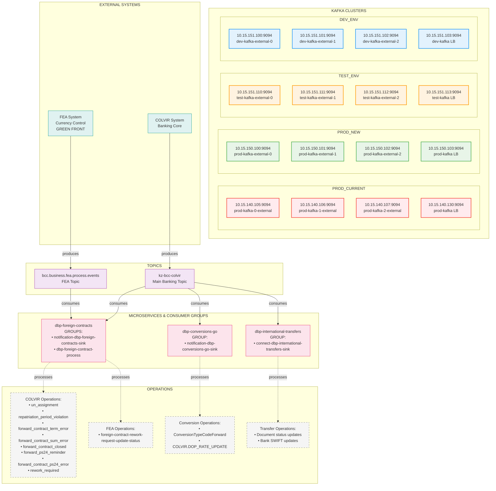
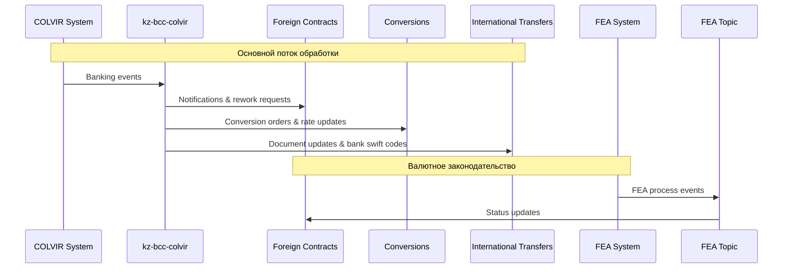

# 📊 KAFKA АРХИТЕКТУРА ПРОЕКТА VED BACKEND

## 🎯 ОБЗОР

Данный документ содержит актуальный анализ архитектуры Apache Kafka в проекте VED Backend. В проекте используется единый кластер Kafka для обеспечения асинхронного взаимодействия между микросервисами банковской системы.

---

## 🏗️ АРХИТЕКТУРА КЛАСТЕРОВ KAFKA

### 📊 KAFKA КЛАСТЕРЫ ПО СРЕДАМ

**PROD кластер (текущий):**
- **Namespace**: `prod-digital-banking-platform`
- **Брокеры**: 
  - `10.15.140.105:9094` (prod-kafka-0-external)
  - `10.15.140.106:9094` (prod-kafka-1-external)  
  - `10.15.140.107:9094` (prod-kafka-2-external)
- **Load Balancer**: `10.15.140.130:9094`

**PROD кластер (новый):**
- **Namespace**: `prod-dbp-infrastructure`
- **Брокеры**:
  - `10.15.150.100:9094` (prod-kafka-external-0)
  - `10.15.150.101:9094` (prod-kafka-external-1)
  - `10.15.150.102:9094` (prod-kafka-external-2)
- **Load Balancer**: `10.15.150.103:9094` (prod-kafka)

### 📊 ПОЛНАЯ КАРТА КЛАСТЕРОВ

| Среда | Namespace | Брокеры | Load Balancer |
|-------|-----------|---------|---------------|
| **PROD (Новый)** | prod-dbp-infrastructure | 10.15.150.100-102:9094 | 10.15.150.103:9094 |
| **PROD (Текущий)** | prod-digital-banking-platform | 10.15.140.105-107:9094 | 10.15.140.130:9094 |
| **TEST** | test-dbp-infrastructure | 10.15.151.110-112:9094 | 10.15.151.113:9094 |
| **DEV** | dev-dbp-infrastructure | 10.15.151.100-102:9094 | 10.15.151.103:9094 |

### ⚠️ ТЕКУЩАЯ КОНФИГУРАЦИЯ (TEST)
- **Количество брокеров**: 3
- **Адреса брокеров**: 
  - `10.15.151.110:9094` (test-kafka-external-0)
  - `10.15.151.111:9094` (test-kafka-external-1)
  - `10.15.151.112:9094` (test-kafka-external-2)
- **Load Balancer**: `10.15.151.113:9094` (test-kafka)
- **Порт**: 9094

---

## 📋 КАТАЛОГ ТОПИКОВ

### 1. 🏦 `kz-bcc-colvir` (Основной топик COLVIR)
- **Назначение**: Центральный топик для обмена данными с банковским ядром COLVIR
- **Тип сообщений**: 
  - Уведомления о банковских операциях
  - Заявки на обработку
  - Статусы транзакций
  - Обновления курсов валют
- **Консюмеры**: 
  - `dbp-foreign-contracts` (группа: `notification-dbp-foreign-contracts-sink`)
  - `dbp-conversions-go` (группа: `notification-dbp-conversions-go-sink`)
  - `dbp-international-transfers` (группа: `connect-dbp-international-transfers-sink`)
- **Продюсеры**: Внешняя система COLVIR

### 2. 🌍 `bcc.business.fea.process.events` (Валютное законодательство)
- **Назначение**: Обработка событий валютного контроля (Foreign Economic Activity)
- **Тип сообщений**:
  - События процессов валютного законодательства
  - Обновления статусов заявок на доработку
  - Уведомления о нарушениях валютного законодательства
- **Консюмеры**: 
  - `dbp-foreign-contracts` (группа: `dbp-foreign-contract-process`)
- **Продюсеры**: Система валютного контроля (GREEN FRONT)

---

## 🔄 МИКРОСЕРВИСЫ И ИХ KAFKA ИНТЕГРАЦИЯ

### 🏢 dbp-foreign-contracts (Валютные контракты)
**Роль**: Consumer only

#### Consumer 1: Colvir Notifications
```yaml
Топик: kz-bcc-colvir
Группа: notification-dbp-foreign-contracts-sink
Файл: /dbp-foreign-contracts/messaging/consumer/consumer.go:58-73
```
**Обрабатываемые операции**:
- `un_assignment` - назначение УН
- `repatriation_period_violation` - нарушение сроков репатриации
- `forward_contract_term_error` - ошибка сроков форвардного контракта
- `forward_contract_sum_error` - ошибка суммы форвардного контракта
- `forward_contract_closed` - закрытие форвардного контракта
- `forward_ps24_reminder` - напоминание по ПС24
- `forward_contract_ps24_error` - ошибка ПС24 по форвардному контракту
- `rework_required` - требуется доработка

#### Consumer 2: FEA Events
```yaml
Топик: bcc.business.fea.process.events
Группа: dbp-foreign-contract-process
Файл: /dbp-foreign-contracts/messaging/consumer/consumer.go:75-90
```
**Обрабатываемые операции**:
- `foreign-contract-rework-request-update-status` - обновление статуса запроса на доработку

### 🔄 dbp-conversions-go (Валютные конверсии)
**Роль**: Consumer only

#### Consumer: Conversion Notifications
```yaml
Топик: kz-bcc-colvir
Группа: notification-dbp-conversions-go-sink
Файл: /dbp-conversions-go/messaging/consumer/consumer.go:54-68
```
**Обрабатываемые операции**:
- Уведомления о валютных конверсиях (`constants.ConversionTypeCodeForward`)
- Обновления курсов валют (`COLVIR.DOP_RATE_UPDATE`)

### 🌐 dbp-international-transfers (Международные переводы)
**Роль**: Consumer only

#### Consumer: Document & Bank Swift Updates
```yaml
Топик: kz-bcc-colvir
Группа: connect-dbp-international-transfers-sink
Файл: /dbp-international-transfers/transport/routes.go:103-135
```
**Обрабатываемые операции**:
- **Обновления статусов документов** - изменение состояний документов международных переводов
- **Обновления банковских SWIFT кодов** - поддержание актуальной информации о банках
- **Обработка ответов от системы COLVIR** - результаты выполнения операций

**Типы сообщений**:
- Document status updates (с `meta.code`, `payload.ordId`, `payload.reason`)
- Bank Swift detail updates (INSERT/UPDATE операции)

---

## 🎨 ДИАГРАММА ВЗАИМОДЕЙСТВИЯ



## 🔍 ДЕТАЛЬНАЯ СХЕМА ПОТОКОВ ДАННЫХ



---

## 📊 CONSUMER GROUPS

| Consumer Group | Сервис | Топик | Статус |
|---|---|---|---|
| `notification-dbp-foreign-contracts-sink` | dbp-foreign-contracts | kz-bcc-colvir | ✅ Активен |
| `dbp-foreign-contract-process` | dbp-foreign-contracts | bcc.business.fea.process.events | ✅ Активен |
| `notification-dbp-conversions-go-sink` | dbp-conversions-go | kz-bcc-colvir | ✅ Активен |
| `connect-dbp-international-transfers-sink` | dbp-international-transfers | kz-bcc-colvir | ✅ Активен |

---

## ⚙️ ТЕХНИЧЕСКАЯ КОНФИГУРАЦИЯ

### Общие настройки Kafka
```yaml
BROKERS: "10.15.151.110:9094, 10.15.151.111:9094, 10.15.151.112:9094"
SLEEP_SECOND: 5        # Задержка при ошибках
CHANNELS_COUNT: 2      # Количество каналов обработки
```

### Специфичные настройки по сервисам

#### dbp-foreign-contracts
```yaml
TOPIC: "kz-bcc-colvir"
GROUP_ID: "connect-kz.bcc.topic.sink.colvir"
FEA_TOPIC: "bcc.business.fea.process.events"
FEA_GROUP_ID: "dbp-foreign-contract-process"
NOTIFICATION_GROUP_ID: "notification-dbp-foreign-contracts-sink"
```

#### dbp-conversions-go
```yaml
TOPIC: "kz-bcc-colvir"
GROUP_ID: "connect-dbp-conversions-go-sink"
NOTIFICATION_GROUP_ID: "notification-dbp-conversions-go-sink"
```

#### dbp-international-transfers
```yaml
TOPIC: "kz-bcc-colvir"
GROUP_ID: "connect-dbp-international-transfers-sink"
```

---

## 📁 СТРУКТУРА КОДА

### Consumer Interface
```go
// /dbp-*/messaging/consumer/consumer.go
type Consumer interface {
    GetMessage() ([]byte, error)
    Close() error
}
```

### Kafka Client Interface
```go
// /dbp-*/messaging/client/client.go
type Client interface {
    GetMessage() ([]byte, error)
    Close(ctx context.Context) error
}
```

---

## 🔧 ТИПЫ СООБЩЕНИЙ

### 1. Broker Messages (kz-bcc-colvir)
```go
type Broker struct {
    OperationCode string `json:"operationCode"`
    Payload       json.RawMessage `json:"payload"`
    // ... другие поля
}
```

### 2. Event Messages (FEA)
```go
type TEvent struct {
    Operation string `json:"operation"`
    Source    string `json:"source"`
    Payload   interface{} `json:"payload"`
    // ... другие поля
}
```

---

## 🚨 МОНИТОРИНГ И ОБСЛУЖИВАНИЕ

### Ключевые метрики для мониторинга
1. **Доступность брокеров** - все 3 брокера должны быть онлайн
2. **Задержка обработки сообщений** - критично для банковских операций
3. **Размер очередей** - предотвращение переполнения топиков
4. **Ошибки консюмеров** - отслеживание failed message processing
5. **Пропускная способность** - количество сообщений в секунду

### Consumer Group Lag
Следить за отставанием каждой consumer group:
- `notification-dbp-foreign-contracts-sink`
- `dbp-foreign-contract-process`
- `notification-dbp-conversions-go-sink`

---

## ⚠️ ВАЖНЫЕ ЗАМЕЧАНИЯ

### Безопасность
- Используется нестандартный порт 9094
- Требуется настройка сетевых правил для доступа к брокерам

### Производительность
- Настроено 2 канала обработки для каждого сервиса
- Задержка 5 секунд при ошибках может замедлить обработку

### Надежность
- 3 брокера обеспечивают отказоустойчивость
- Отдельные consumer groups предотвращают конфликты
- Graceful shutdown реализован для всех компонентов

---

## 🔄 ПРОЦЕДУРЫ РАЗВЕРТЫВАНИЯ

### Запуск сервисов
1. Убедиться в доступности всех 3 брокеров Kafka
2. Проверить создание необходимых топиков
3. Запустить сервисы в порядке зависимостей
4. Верифицировать подключение к consumer groups

### Масштабирование
- Можно добавлять партиции к существующим топикам
- Увеличение количества каналов обработки в конфигурации
- Добавление новых consumer instances для балансировки нагрузки

---

## 📈 ПЛАНЫ РАЗВИТИЯ

### Потенциальные улучшения
1. **Добавление метрик** - интеграция с Prometheus/Grafana
2. **Улучшение обработки ошибок** - dead letter queues
3. **Батчинг сообщений** - повышение производительности
4. **Schema Registry** - версионирование схем сообщений

### Новые интеграции
- Потенциальные новые топики для других банковских продуктов
- Интеграция с системами аудита и логирования
- Подключение внешних партнерских систем

---

## 📞 КОНТАКТЫ И ПОДДЕРЖКА

Для вопросов по архитектуре Kafka обращаться к команде разработки платформы VED Backend.

**Дата создания документа**: 2025-07-24  
**Версия**: 2.0 (актуальное состояние)  
**Автор**: Claude Code Analysis