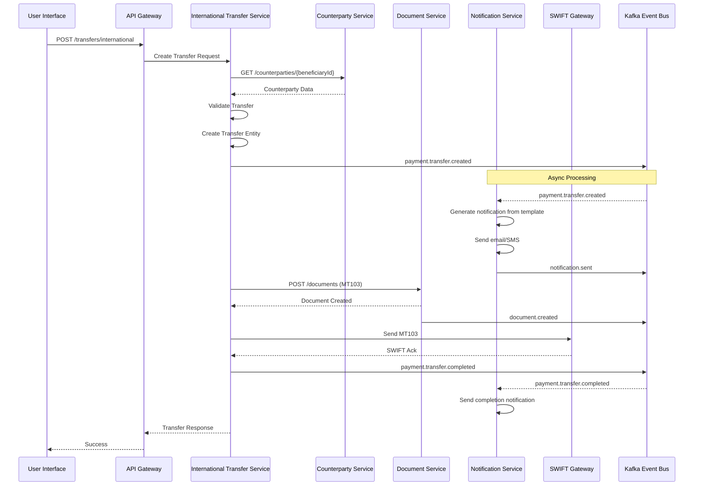
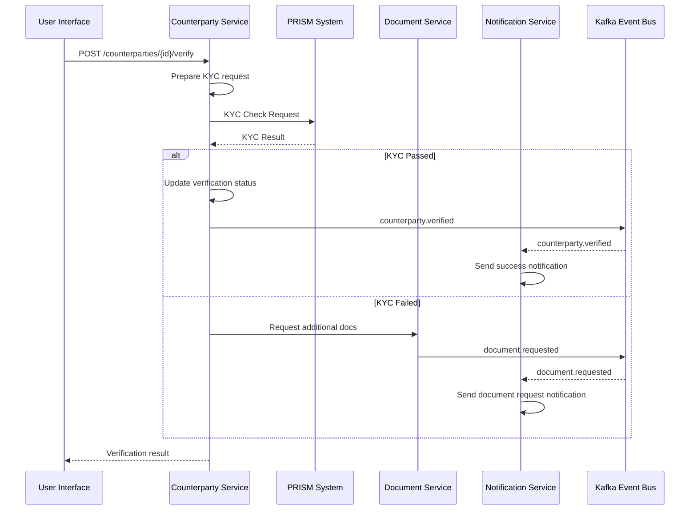
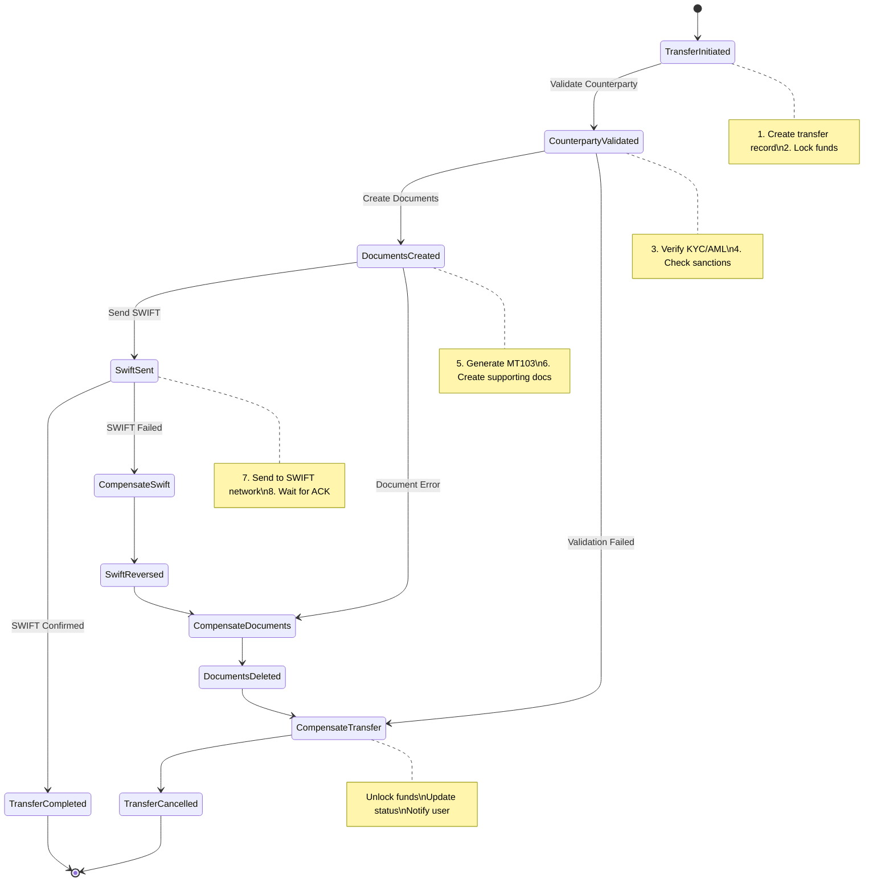

# 🔧 VED Backend - DDD Рефакторинг TODO

## 📋 Обзор текущих проблем

### 🚨 Критические проблемы архитектуры
- **Shared Database Anti-pattern**: Несколько сервисов работают с одной БД
- **Размытые доменные границы**: Отсутствие четких bounded contexts  
- **Анемичные модели**: Бизнес-логика разбросана по service слоям
- **Тесная связанность**: Общие модели и зависимости между сервисами
- **God Service**: dbp-documents знает о всех типах документов

---

## 🎯 Рекомендации по DDD рефакторингу

### 1. 🏗️ **ПРИОРИТЕТ 1: Реорганизация доменов (6 микросервисов)**

#### 1.1 Финальная архитектура микросервисов
```
ТЕКУЩЕЕ СОСТОЯНИЕ (5 сервисов):
├── dbp-international-transfers
├── dbp-conversions-go
├── dbp-foreign-contracts
├── dbp-prism-api
└── dbp-documents

ФИНАЛЬНАЯ АРХИТЕКТУРА (7 сервисов):
├── international-transfer-service   # Международные переводы
├── currency-conversion-service      # Валютные конверсии
├── domestic-transfer-service        # Внутренние переводы
├── document-management-service      # Управление документами
├── contract-management-service      # Внешнеторговые контракты
├── counterparty-service            # Контрагенты и KYC
└── notification-service            # Уведомления и коммуникации
```

#### 1.2 International Transfer Service
```
└── international-transfer-service/
    ├── domain/
    │   ├── transfer/                # Агрегат корень
    │   ├── beneficiary/             # Сущность
    │   └── swift-message/           # Value Object
    └── infrastructure/
        ├── swift-gateway/           # SWIFT интеграция
        └── zeebe-adapter/           # Camunda/Zeebe
```

**Задачи:**
- [ ] Выделить из dbp-international-transfers
- [ ] Создать Transfer агрегат с бизнес-логикой
- [ ] Реализовать SWIFT message builder
- [ ] Интегрировать Zeebe для workflow

#### 1.3 Currency Conversion Service
```
└── currency-conversion-service/
    ├── domain/
    │   ├── conversion/              # Агрегат корень
    │   ├── rate/                    # Сущность
    │   └── money/                   # Value Object
    └── infrastructure/
        └── rate-provider/           # Источники курсов
```

**Задачи:**
- [ ] Выделить из dbp-conversions-go
- [ ] Создать Conversion агрегат
- [ ] Реализовать правила конверсии
- [ ] Добавить rate caching

#### 1.4 Domestic Transfer Service  
```
└── domestic-transfer-service/
    ├── domain/
    │   ├── transfer/                # Агрегат корень
    │   └── account/                 # Сущность
    └── infrastructure/
        └── colvir-adapter/          # Интеграция с CBS
```

**Задачи:**
- [ ] Создать новый сервис для внутренних переводов
- [ ] Реализовать Transfer агрегат
- [ ] Интегрировать с Colvir
- [ ] Добавить валидацию счетов

#### 1.5 Document Management Service
```
└── document-management-service/
    ├── domain/
    │   ├── document/                # Агрегат корень
    │   ├── signature/               # Агрегат  
    │   └── attachment/              # Сущность
    └── infrastructure/
        ├── minio-storage/           # Хранилище файлов
        └── cuba-reports/            # Генерация документов
```

**Задачи:**
- [ ] Рефакторить dbp-documents
- [ ] Создать Document агрегат с жизненным циклом
- [ ] Выделить Signature как отдельный агрегат
- [ ] Убрать знание о типах документов из домена

#### 1.6 Contract Management Service
```
└── contract-management-service/
    ├── domain/
    │   ├── contract/                # Агрегат корень
    │   ├── contract-party/          # Сущность
    │   └── tnved/                   # Value Object
    └── infrastructure/
        └── regulatory-validator/     # Валидация по законодательству
```

**Задачи:**
- [ ] Рефакторить dbp-foreign-contracts
- [ ] Создать Contract агрегат
- [ ] Реализовать валидацию ТНВЭД
- [ ] Добавить regulatory compliance

#### 1.7 Counterparty Service
```
└── counterparty-service/
    ├── domain/
    │   ├── counterparty/            # Агрегат корень
    │   └── verification/            # Сущность
    └── infrastructure/
        └── prism-adapter/           # PRISM интеграция
```

**Задачи:**
- [ ] Объединить dbp-prism-api
- [ ] Создать Counterparty агрегат
- [ ] Реализовать KYC процессы
- [ ] Добавить санкционные проверки

#### 1.8 Notification Service
```
└── notification-service/
    ├── domain/
    │   ├── notification/            # Агрегат корень
    │   ├── template/                # Сущность
    │   └── preference/              # Value Object
    └── infrastructure/
        ├── email-provider/          # SMTP интеграция
        ├── sms-provider/            # SMS gateway
        └── push-provider/           # FCM/APNS
```

**Задачи:**
- [ ] Создать новый notification-service
- [ ] Реализовать Notification агрегат
- [ ] Добавить шаблонизатор уведомлений
- [ ] Интегрировать провайдеры доставки

### 2. 🗄️ **ПРИОРИТЕТ 2: Устранение Shared Database**

#### 2.1 Database per Service - Финальная архитектура (7 микросервисов)

```
ТЕКУЩЕЕ:
└── test_dbp_business_international_transfers_db (SHARED DB)
    ├── documents (общая для всех)
    ├── international_transfers  
    ├── currency_conversions
    └── international_contracts

ФИНАЛЬНАЯ АРХИТЕКТУРА (7 БД):
├── international_transfer_db/
│   ├── transfers
│   ├── transfer_states
│   ├── transfer_documents
│   ├── beneficiaries
│   ├── swift_messages
│   └── transfer_history
│
├── currency_conversion_db/
│   ├── conversions
│   ├── conversion_rates
│   ├── conversion_documents
│   └── conversion_history
│
├── domestic_transfer_db/
│   ├── transfers
│   ├── transfer_states
│   ├── accounts
│   └── transfer_history
│
├── document_management_db/
│   ├── documents
│   ├── document_types
│   ├── document_states
│   ├── signatures
│   ├── attachments
│   └── document_versions
│
├── contract_management_db/
│   ├── contracts
│   ├── contract_parties
│   ├── contract_documents
│   ├── tnved_codes
│   └── contract_history
│
├── counterparty_db/
│   ├── counterparties
│   ├── counterparty_verifications
│   ├── kyc_documents
│   └── counterparty_relationships
│
└── notification_db/
    ├── notifications
    ├── notification_templates
    ├── user_preferences
    ├── delivery_status
    └── notification_history
```

#### 2.2 Детальная схема БД и таблиц

##### 🏦 **1. international_transfer_db**
```sql
-- Основная таблица международных переводов
CREATE TABLE transfers (
    id UUID PRIMARY KEY,
    transfer_number VARCHAR(50) UNIQUE NOT NULL,
    amount DECIMAL(19,4) NOT NULL,
    currency_code VARCHAR(3) NOT NULL,
    status VARCHAR(50) NOT NULL,
    beneficiary_id UUID NOT NULL,
    created_at TIMESTAMP NOT NULL,
    updated_at TIMESTAMP,
    -- Денормализованные данные для производительности
    sender_name VARCHAR(255),
    sender_account VARCHAR(50),
    -- FOREIGN KEY to beneficiaries(id)
);

-- Получатели платежей
CREATE TABLE beneficiaries (
    id UUID PRIMARY KEY,
    name VARCHAR(255) NOT NULL,
    account_number VARCHAR(50) NOT NULL,
    bank_swift VARCHAR(11),
    bank_name VARCHAR(255),
    country_code VARCHAR(2),
    address TEXT
);

-- SWIFT сообщения
CREATE TABLE swift_messages (
    id UUID PRIMARY KEY,
    transfer_id UUID NOT NULL,
    message_type VARCHAR(10), -- MT103, MT202
    message_content TEXT,
    status VARCHAR(50),
    created_at TIMESTAMP,
    -- FOREIGN KEY to transfers(id)
);

-- История изменений
CREATE TABLE transfer_history (
    id UUID PRIMARY KEY,
    transfer_id UUID NOT NULL,
    action VARCHAR(100),
    performed_by VARCHAR(255),
    performed_at TIMESTAMP,
    details JSONB
);

-- Связь с документами (через события)
CREATE TABLE transfer_documents (
    transfer_id UUID NOT NULL,
    document_id UUID NOT NULL, -- ID из document_management_db
    document_type VARCHAR(50),
    PRIMARY KEY (transfer_id, document_id)
);
```

##### 💱 **2. currency_conversion_db**
```sql
-- Основная таблица конверсий
CREATE TABLE conversions (
    id UUID PRIMARY KEY,
    conversion_number VARCHAR(50) UNIQUE NOT NULL,
    from_amount DECIMAL(19,4) NOT NULL,
    from_currency VARCHAR(3) NOT NULL,
    to_amount DECIMAL(19,4) NOT NULL,
    to_currency VARCHAR(3) NOT NULL,
    rate DECIMAL(19,8) NOT NULL,
    status VARCHAR(50) NOT NULL,
    client_id VARCHAR(50),
    created_at TIMESTAMP NOT NULL
);

-- Курсы валют
CREATE TABLE conversion_rates (
    id UUID PRIMARY KEY,
    from_currency VARCHAR(3) NOT NULL,
    to_currency VARCHAR(3) NOT NULL,
    rate DECIMAL(19,8) NOT NULL,
    rate_type VARCHAR(50), -- market, preferential, internal
    valid_from TIMESTAMP NOT NULL,
    valid_to TIMESTAMP,
    source VARCHAR(50) -- colvir, manual, external
);

-- История конверсий
CREATE TABLE conversion_history (
    id UUID PRIMARY KEY,
    conversion_id UUID NOT NULL,
    action VARCHAR(100),
    performed_by VARCHAR(255),
    performed_at TIMESTAMP,
    old_values JSONB,
    new_values JSONB
);
```

##### 🏠 **3. domestic_transfer_db**
```sql
-- Внутренние переводы
CREATE TABLE transfers (
    id UUID PRIMARY KEY,
    transfer_number VARCHAR(50) UNIQUE NOT NULL,
    amount DECIMAL(19,4) NOT NULL,
    currency VARCHAR(3) NOT NULL,
    from_account VARCHAR(50) NOT NULL,
    to_account VARCHAR(50) NOT NULL,
    status VARCHAR(50) NOT NULL,
    purpose TEXT,
    created_at TIMESTAMP NOT NULL
);

-- Счета (денормализованная копия)
CREATE TABLE accounts (
    account_number VARCHAR(50) PRIMARY KEY,
    client_id VARCHAR(50),
    currency VARCHAR(3),
    account_type VARCHAR(50),
    is_active BOOLEAN,
    -- Синхронизируется через события
);
```

##### 📄 **4. document_management_db**
```sql
-- Документы
CREATE TABLE documents (
    id UUID PRIMARY KEY,
    document_number VARCHAR(100) UNIQUE NOT NULL,
    document_type_id INT NOT NULL,
    state_id INT NOT NULL,
    entity_id UUID, -- ID сущности (transfer, contract, etc)
    entity_type VARCHAR(50), -- тип сущности
    created_at TIMESTAMP NOT NULL,
    updated_at TIMESTAMP
);

-- Типы документов
CREATE TABLE document_types (
    id SERIAL PRIMARY KEY,
    code VARCHAR(50) UNIQUE NOT NULL,
    name VARCHAR(255) NOT NULL,
    template_path VARCHAR(500),
    required_signatures INT DEFAULT 0
);

-- Состояния документов
CREATE TABLE document_states (
    id SERIAL PRIMARY KEY,
    code VARCHAR(50) UNIQUE NOT NULL,
    name VARCHAR(255) NOT NULL,
    is_final BOOLEAN DEFAULT FALSE
);

-- Подписи
CREATE TABLE signatures (
    id UUID PRIMARY KEY,
    document_id UUID NOT NULL,
    signer_id VARCHAR(255) NOT NULL,
    signature_type VARCHAR(50), -- eds, manual
    signed_at TIMESTAMP,
    signature_data TEXT,
    -- FOREIGN KEY to documents(id)
);

-- Вложения
CREATE TABLE attachments (
    id UUID PRIMARY KEY,
    document_id UUID NOT NULL,
    file_name VARCHAR(255) NOT NULL,
    file_path VARCHAR(500) NOT NULL,
    file_size BIGINT,
    mime_type VARCHAR(100),
    uploaded_at TIMESTAMP,
    -- FOREIGN KEY to documents(id)
);

-- Версии документов
CREATE TABLE document_versions (
    id UUID PRIMARY KEY,
    document_id UUID NOT NULL,
    version_number INT NOT NULL,
    content TEXT,
    created_at TIMESTAMP,
    created_by VARCHAR(255),
    -- FOREIGN KEY to documents(id)
);
```

##### 📑 **5. contract_management_db**
```sql
-- Контракты
CREATE TABLE contracts (
    id UUID PRIMARY KEY,
    contract_number VARCHAR(100) UNIQUE NOT NULL,
    contract_date DATE NOT NULL,
    amount DECIMAL(19,4),
    currency VARCHAR(3),
    counterparty_id UUID NOT NULL, -- ID из counterparty_db
    status VARCHAR(50) NOT NULL,
    expiry_date DATE,
    created_at TIMESTAMP NOT NULL
);

-- Стороны контракта
CREATE TABLE contract_parties (
    id UUID PRIMARY KEY,
    contract_id UUID NOT NULL,
    party_type VARCHAR(50), -- buyer, seller, agent
    party_id UUID NOT NULL, -- ID из counterparty_db
    role_description TEXT,
    -- FOREIGN KEY to contracts(id)
);

-- ТНВЭД коды
CREATE TABLE tnved_codes (
    code VARCHAR(20) PRIMARY KEY,
    description TEXT NOT NULL,
    parent_code VARCHAR(20),
    level INT NOT NULL
);

-- Товары контракта
CREATE TABLE contract_goods (
    id UUID PRIMARY KEY,
    contract_id UUID NOT NULL,
    tnved_code VARCHAR(20),
    description TEXT,
    quantity DECIMAL(19,4),
    unit VARCHAR(50),
    unit_price DECIMAL(19,4),
    -- FOREIGN KEY to contracts(id)
    -- FOREIGN KEY to tnved_codes(code)
);
```

##### 👥 **6. counterparty_db**
```sql
-- Контрагенты
CREATE TABLE counterparties (
    id UUID PRIMARY KEY,
    code VARCHAR(50) UNIQUE NOT NULL,
    name VARCHAR(500) NOT NULL,
    type VARCHAR(50), -- individual, company
    country_code VARCHAR(2),
    tax_id VARCHAR(50),
    is_verified BOOLEAN DEFAULT FALSE,
    created_at TIMESTAMP NOT NULL
);

-- Верификация KYC
CREATE TABLE counterparty_verifications (
    id UUID PRIMARY KEY,
    counterparty_id UUID NOT NULL,
    verification_type VARCHAR(50), -- kyc, aml, sanctions
    status VARCHAR(50),
    verified_at TIMESTAMP,
    verified_by VARCHAR(255),
    result JSONB,
    -- FOREIGN KEY to counterparties(id)
);

-- Документы KYC
CREATE TABLE kyc_documents (
    id UUID PRIMARY KEY,
    counterparty_id UUID NOT NULL,
    document_type VARCHAR(50),
    document_number VARCHAR(100),
    issue_date DATE,
    expiry_date DATE,
    file_path VARCHAR(500),
    -- FOREIGN KEY to counterparties(id)
);
```

##### 🔔 **7. notification_db**
```sql
-- Основная таблица уведомлений
CREATE TABLE notifications (
    id UUID PRIMARY KEY,
    notification_type VARCHAR(50) NOT NULL, -- email, sms, push, in_app
    template_id UUID NOT NULL,
    recipient_id VARCHAR(255) NOT NULL,
    recipient_address VARCHAR(500), -- email, phone, device_token
    subject VARCHAR(500),
    content TEXT,
    status VARCHAR(50) NOT NULL, -- pending, sent, failed, delivered
    priority INT DEFAULT 5, -- 1-10
    scheduled_at TIMESTAMP,
    sent_at TIMESTAMP,
    created_at TIMESTAMP NOT NULL,
    -- FOREIGN KEY to notification_templates(id)
);

-- Шаблоны уведомлений
CREATE TABLE notification_templates (
    id UUID PRIMARY KEY,
    code VARCHAR(100) UNIQUE NOT NULL,
    name VARCHAR(255) NOT NULL,
    channel VARCHAR(50) NOT NULL, -- email, sms, push
    language VARCHAR(10) DEFAULT 'ru',
    subject_template TEXT,
    body_template TEXT, -- с плейсхолдерами {{variable}}
    is_active BOOLEAN DEFAULT TRUE,
    created_at TIMESTAMP NOT NULL
);

-- Предпочтения пользователей
CREATE TABLE user_preferences (
    id UUID PRIMARY KEY,
    user_id VARCHAR(255) UNIQUE NOT NULL,
    email_enabled BOOLEAN DEFAULT TRUE,
    sms_enabled BOOLEAN DEFAULT TRUE,
    push_enabled BOOLEAN DEFAULT TRUE,
    language VARCHAR(10) DEFAULT 'ru',
    quiet_hours_start TIME,
    quiet_hours_end TIME,
    updated_at TIMESTAMP
);

-- Статус доставки
CREATE TABLE delivery_status (
    id UUID PRIMARY KEY,
    notification_id UUID NOT NULL,
    provider VARCHAR(100), -- smtp, twilio, firebase
    provider_message_id VARCHAR(255),
    status VARCHAR(50), -- sent, delivered, opened, clicked, bounced
    status_details TEXT,
    updated_at TIMESTAMP,
    -- FOREIGN KEY to notifications(id)
);

-- История уведомлений
CREATE TABLE notification_history (
    id UUID PRIMARY KEY,
    notification_id UUID NOT NULL,
    action VARCHAR(100),
    details JSONB,
    created_at TIMESTAMP,
    -- FOREIGN KEY to notifications(id)
);

-- Подписки на события
CREATE TABLE event_subscriptions (
    id UUID PRIMARY KEY,
    event_type VARCHAR(100) NOT NULL, -- payment.completed, contract.signed
    channel VARCHAR(50) NOT NULL,
    template_id UUID NOT NULL,
    is_active BOOLEAN DEFAULT TRUE,
    -- FOREIGN KEY to notification_templates(id)
);
```

#### 2.3 Межсервисное взаимодействие через события

```yaml
# Event Bus (Kafka Topics) - Новая архитектура
topics:
  # Платежные события
  - payment.transfer.created
  - payment.transfer.completed
  - payment.transfer.failed
  - payment.conversion.executed
  
  # Документные события
  - document.created
  - document.signed
  - document.attached
  
  # Контрактные события
  - contract.created
  - contract.signed
  - contract.expired
  
  # События контрагентов
  - counterparty.created
  - counterparty.verified
  - counterparty.updated
  
  # События уведомлений
  - notification.requested
  - notification.sent
  - notification.delivered
  - notification.failed
  
  # Существующие топики (legacy)
  - kz-bcc-colvir  # От COLVIR системы
  - bcc.business.fea.process.events  # От GREEN FRONT
```

#### 2.4 Паттерны синхронизации данных

##### Read Models (CQRS)
```sql
-- Пример: Read model в international_transfer_db для контрагентов
CREATE MATERIALIZED VIEW counterparty_cache AS
SELECT 
    id,
    code,
    name,
    country_code,
    is_verified
FROM counterparty_events
WHERE event_type IN ('created', 'updated')
AND is_latest = true;

-- Обновляется через Kafka consumer
```

##### Event Sourcing для критических операций
```sql
-- Event store в каждом сервисе
CREATE TABLE domain_events (
    id UUID PRIMARY KEY,
    aggregate_id UUID NOT NULL,
    aggregate_type VARCHAR(100) NOT NULL,
    event_type VARCHAR(100) NOT NULL,
    event_data JSONB NOT NULL,
    event_version INT NOT NULL,
    created_at TIMESTAMP NOT NULL,
    created_by VARCHAR(255)
);

CREATE INDEX idx_domain_events_aggregate ON domain_events(aggregate_id, event_version);
```

#### 2.5 Визуальная схема архитектуры (7 микросервисов)

```
┌─────────────────────────────────────────────────────────────────────────────┐
│                              API Gateway / BFF                               │
└─────────────────────────────────────────────────────────────────────────────┘
                                        │
    ┌───────────────────────────────────┴─────────────────────────────────────┐
    │                                                                         │
┌───▼───────────┐  ┌─────────────┐  ┌─────────────┐  ┌─────────────┐  ┌─────▼─────────┐
│ International │  │  Currency   │  │  Domestic   │  │  Document   │  │ Notification  │
│   Transfer    │  │ Conversion  │  │  Transfer   │  │ Management  │  │   Service     │
│   Service     │  │  Service    │  │  Service    │  │  Service    │  │               │
├───────────────┤  ├─────────────┤  ├─────────────┤  ├─────────────┤  ├───────────────┤
│ • Transfers   │  │ • Conversions│  │ • Transfers │  │ • Documents │  │ • Templates   │
│ • Beneficiary │  │ • Rates     │  │ • Accounts  │  │ • Signatures│  │ • Delivery    │
│ • SWIFT       │  │ • History   │  │ • History   │  │ • Versions  │  │ • Preferences │
└───────┬───────┘  └──────┬──────┘  └──────┬──────┘  └──────┬──────┘  └───────┬───────┘
        │                 │                 │                 │                 │
   ┌────▼────┐       ┌────▼────┐      ┌────▼────┐      ┌────▼────┐       ┌────▼────┐
   │   DB    │       │   DB    │      │   DB    │      │   DB    │       │   DB    │
   └─────────┘       └─────────┘      └─────────┘      └─────────┘       └─────────┘
                                                                                │
                  ┌─────────────────────────────────────────────────────────────┤
                  │                                                             │
         ┌────────▼────────┐                                          ┌────────▼────────┐
         │    Contract     │                                          │   Counterparty  │
         │   Management    │                                          │     Service     │
         │    Service      │                                          │                 │
         ├─────────────────┤                                          ├─────────────────┤
         │ • Contracts     │                                          │ • Counterparties│
         │ • Parties       │                                          │ • Verifications │
         │ • TNVED codes   │                                          │ • KYC Documents │
         └────────┬────────┘                                          └────────┬────────┘
                  │                                                             │
             ┌────▼────┐                                                  ┌────▼────┐
             │   DB    │                                                  │   DB    │
             └─────────┘                                                  └─────────┘

                              ┌─────────────────────────┐
                              │   Kafka Event Bus       │
                              ├─────────────────────────┤
                              │ • payment.events        │
                              │ • document.events       │
                              │ • contract.events       │
                              │ • counterparty.events   │
                              │ • notification.events   │
                              │ • kz-bcc-colvir        │
                              │ • fea.process.events    │
                              └───────────┬─────────────┘
                                          │
                    ┌─────────────────────┴─────────────────────┐
                    │                                           │
              ┌─────▼─────┐                              ┌─────▼─────┐
              │  COLVIR   │                              │   GREEN   │
              │  System   │                              │   FRONT   │
              └───────────┘                              └───────────┘
```

#### 2.6 Межсервисные связи и API контракты

```yaml
# API между сервисами
international-transfer-service:
  consumes:
    - GET /api/v1/counterparties/{id} (from counterparty-service)
    - POST /api/v1/documents (to document-management-service)
    - GET /api/v1/conversion-rates (from currency-conversion-service)
  publishes:
    - payment.transfer.created
    - payment.transfer.completed
    - payment.transfer.failed

currency-conversion-service:
  consumes:
    - GET /api/v1/counterparties/{id} (from counterparty-service)
    - POST /api/v1/documents (to document-management-service)
  publishes:
    - payment.conversion.executed
    - payment.conversion.reversed

domestic-transfer-service:
  consumes:
    - POST /api/v1/documents (to document-management-service)
  publishes:
    - payment.transfer.created
    - payment.transfer.completed

document-management-service:
  consumes:
    - События от всех сервисов для связывания документов
  provides:
    - POST /api/v1/documents
    - GET /api/v1/documents/{id}
    - POST /api/v1/documents/{id}/sign
    - POST /api/v1/documents/{id}/attachments

contract-management-service:
  consumes:
    - GET /api/v1/counterparties/{id} (from counterparty-service)
    - POST /api/v1/documents (to document-management-service)
  publishes:
    - contract.created
    - contract.signed
    - contract.expired

counterparty-service:
  provides:
    - GET /api/v1/counterparties/{id}
    - POST /api/v1/counterparties
    - POST /api/v1/counterparties/{id}/verify
  publishes:
    - counterparty.created
    - counterparty.verified
    - counterparty.updated

notification-service:
  consumes:
    - payment.transfer.* (все события переводов)
    - payment.conversion.* (все события конверсий)
    - contract.* (все события контрактов)
    - document.signed (подписание документов)
    - counterparty.verified (верификация контрагентов)
  provides:
    - POST /api/v1/notifications
    - GET /api/v1/notifications/{id}
    - PUT /api/v1/users/{userId}/preferences
    - GET /api/v1/templates
  publishes:
    - notification.sent
    - notification.delivered
    - notification.failed
```

**Задачи:**
- [ ] Создать отдельные БД для каждого из 7 сервисов
- [ ] Реализовать data migration стратегию для разделения shared DB
- [ ] Определить ownership для каждой таблицы
- [ ] Создать read models для межсервисных запросов
- [ ] Реализовать eventual consistency через события
- [ ] Настроить репликацию критических данных между сервисами

#### 2.7 Детальные Sequence Диаграммы

##### Международный перевод с уведомлениями


##### Валютная конверсия с контрактом

```mermaid
sequenceDiagram
    participant UI as User Interface
    participant CCS as Currency Conversion Service
    participant CMS as Contract Service
    participant DTS as Domestic Transfer Service
    participant DMS as Document Service
    participant NS as Notification Service
    participant Kafka as Kafka Event Bus

    UI->>CCS: POST /conversions
    CCS->>CCS: Lock exchange rate
    CCS->>Kafka: payment.conversion.initiated
    
    CCS->>CMS: GET /contracts/{contractId}
    CMS-->>CCS: Contract details
    
    CCS->>DTS: POST /transfers (debit)
    DTS-->>CCS: Debit completed
    DTS->>Kafka: payment.transfer.completed
    
    CCS->>DTS: POST /transfers (credit)
    DTS-->>CCS: Credit completed
    DTS->>Kafka: payment.transfer.completed
    
    CCS->>DMS: POST /documents (conversion)
    DMS-->>CCS: Document created
    
    CCS->>Kafka: payment.conversion.executed
    
    Note over Kafka,NS: Notification flow
    Kafka-->>NS: payment.conversion.executed
    NS->>NS: Process notification
    NS->>NS: Send notifications
    
    CCS-->>UI: Conversion completed
```


##### KYC верификация с уведомлениями


#### 2.8 Kafka Topics Flow (Новая архитектура)

```mermaid
graph TB
    subgraph "Legacy Systems"
        COLVIR[COLVIR System]
        GREENFRONT[GREEN FRONT]
    end
    
    subgraph "Kafka Topics"
        T1[kz-bcc-colvir]
        T2[bcc.business.fea.process.events]
        T3[payment.transfer.*]
        T4[payment.conversion.*]
        T5[contract.*]
        T6[document.*]
        T7[counterparty.*]
        T8[notification.*]
    end
    
    subgraph "Microservices"
        ITS[International Transfer Service]
        CCS[Currency Conversion Service]
        DTS[Domestic Transfer Service]
        CMS[Contract Management Service]
        DMS[Document Management Service]
        CS[Counterparty Service]
        NS[Notification Service]
    end
    
    %% Legacy connections
    COLVIR -->|produces| T1
    GREENFRONT -->|produces| T2
    
    %% Service connections
    ITS -->|consumes| T1
    ITS -->|produces| T3
    ITS -->|consumes| T6
    
    CCS -->|consumes| T1
    CCS -->|produces| T4
    
    DTS -->|produces| T3
    
    CMS -->|consumes| T1
    CMS -->|consumes| T2
    CMS -->|produces| T5
    
    DMS -->|produces| T6
    
    CS -->|produces| T7
    
    NS -->|consumes| T3
    NS -->|consumes| T4
    NS -->|consumes| T5
    NS -->|consumes| T6
    NS -->|consumes| T7
    NS -->|produces| T8
    
    %% Styling
    classDef legacy fill:#ffebee,stroke:#f44336
    classDef topic fill:#e3f2fd,stroke:#2196f3
    classDef service fill:#e8f5e9,stroke:#4caf50
    
    class COLVIR,GREENFRONT legacy
    class T1,T2,T3,T4,T5,T6,T7,T8 topic
    class ITS,CCS,DTS,CMS,DMS,CS,NS service
```



#### 2.9 SAGA Pattern Example: International Transfer



#### 2.10 Межсервисное взаимодействие
**Задачи:**
- [ ] Реализовать Domain Events для асинхронной связи
- [ ] Создать Event Store для источника истины
- [ ] Реализовать Saga Pattern для долгих транзакций
- [ ] Добавить Circuit Breaker для устойчивости
- [ ] Создать API Gateway для внешних клиентов
- [ ] Настроить service mesh для межсервисной коммуникации
- [ ] Внедрить distributed tracing (Jaeger/Zipkin)
- [ ] Настроить централизованное логирование

### 3. 🧩 **ПРИОРИТЕТ 3: Реализация DDD паттернов**

#### 3.1 Богатые доменные модели
```go
// БЫЛО (анемичная модель):
type InternationalTransfer struct {
    ID       int64
    Amount   float64
    Currency string
    Status   string
}

// ДОЛЖНО СТАТЬ (богатая модель):
type InternationalTransfer struct {
    id           TransferID
    amount       Money
    beneficiary  Beneficiary
    status       TransferStatus
}

func (t *InternationalTransfer) Process() error {
    if !t.canBeProcessed() {
        return errors.New("transfer cannot be processed")
    }
    t.status = TransferStatusProcessing
    return nil
}
```

**Задачи:**
- [ ] Создать Value Objects: Money, Currency, Account, SWIFT
- [ ] Реализовать бизнес-логику в агрегатах
- [ ] Добавить доменные валидации
- [ ] Создать фабрики для создания агрегатов
- [ ] Реализовать спецификации для сложных запросов

#### 3.2 Доменные события
```go
type TransferProcessed struct {
    TransferID   TransferID
    Amount       Money
    ProcessedAt  time.Time
}

type ContractSigned struct {
    ContractID  ContractID
    SignedBy    UserID
    SignedAt    time.Time
}
```

**Задачи:**
- [ ] Определить все доменные события
- [ ] Реализовать Event Publisher/Subscriber
- [ ] Создать Event Handlers в каждом домене
- [ ] Добавить событийное логирование (Event Sourcing)
- [ ] Реализовать проекции для read models

### 4. 🔧 **ПРИОРИТЕТ 4: Улучшения кода**

#### 4.1 Архитектурные улучшения
**Задачи:**
- [ ] Реализовать Clean Architecture (слои)
- [ ] Добавить CQRS для разделения команд и запросов
- [ ] Создать Application Services для оркестрации
- [ ] Добавить Unit of Work паттерн
- [ ] Реализовать Repository с доменными интерфейсами

#### 4.2 Качество кода
**Задачи:**
- [ ] Добавить unit тесты для доменной логики
- [ ] Создать integration тесты для агрегатов
- [ ] Добавить контрактные тесты между сервисами
- [ ] Реализовать тестовые дублеры (mocks) для внешних систем
- [ ] Добавить статический анализ кода (golangci-lint)

#### 4.3 Обработка ошибок
```go
// Создать доменные ошибки:
type DomainError interface {
    error
    Code() string
    Domain() string
}

type TransferValidationError struct {
    field string
    value interface{}
}
```

**Задачи:**
- [ ] Создать иерархию доменных ошибок
- [ ] Реализовать централизованную обработку ошибок
- [ ] Добавить структурированное логирование
- [ ] Создать метрики для мониторинга
- [ ] Добавить distributed tracing

---

## 🚀 План миграции

### Фаза 1: Подготовка (2-3 недели)
1. Создать новую структуру проекта
2. Выделить Value Objects и общие концепции
3. Создать доменные интерфейсы

### Фаза 2: Payment Domain (4-5 недель)  
1. Объединить международные переводы и конверсии
2. Создать богатые агрегаты
3. Реализовать доменные события
4. Мигрировать БД

### Фаза 3: Document Domain (3-4 недели)
1. Выделить документооборот в отдельный сервис
2. Реализовать workflow engine
3. Создать отдельную БД документов

### Фаза 4: Contract & Counterparty (3-4 недели)
1. Рефакторить contract management
2. Интегрировать PRISM как адаптер
3. Реализовать межсервисное взаимодействие

### Фаза 5: Оптимизация (2-3 недели)
1. Добавить мониторинг и метрики
2. Оптимизировать производительность
3. Улучшить тестирование

---

## ⚠️ Потенциальные проблемы и решения

### Проблема 1: Data Consistency
**Проблема**: При разделении БД возможны проблемы с консистентностью
**Решение**: 
- Реализовать Saga Pattern для долгих транзакций
- Использовать Event Sourcing для восстановления состояния
- Добавить compensating actions

### Проблема 2: Performance
**Проблема**: Межсервисные вызовы могут замедлить систему
**Решение**:
- Создать read models для часто запрашиваемых данных
- Реализовать кеширование на уровне приложения
- Использовать асинхронную обработку где возможно

### Проблема 3: Migration Complexity  
**Проблема**: Сложность миграции существующих данных
**Решение**:
- Реализовать Strangler Fig Pattern для постепенной миграции
- Создать адаптеры для старых API
- Использовать feature flags для переключения

### Проблема 4: Team Coordination
**Проблема**: Необходима координация между командами
**Решение**:
- Создать contract-first API design
- Использовать consumer-driven contracts
- Регулярные архитектурные ревью

---

## 📊 Метрики успеха

### Технические метрики:
- [ ] Покрытие кода тестами > 80%
- [ ] Время сборки < 5 минут
- [ ] Время деплоя < 10 минут
- [ ] Latency P95 < 500ms
- [ ] Error rate < 0.1%

### Архитектурные метрики:
- [ ] Независимость сервисов (отсутствие shared DB)
- [ ] Богатые доменные модели (бизнес-логика в агрегатах)
- [ ] Обособленность bounded contexts
- [ ] Минимальная связанность между сервисами

### Бизнес метрики:
- [ ] Время разработки новых фич
- [ ] Количество багов в продакшене
- [ ] Time-to-market для новых продуктов
- [ ] Developer experience score

---

## 🐛 Критические проблемы в коде (требуют немедленного внимания)

### 1. **АРХИТЕКТУРНЫЕ АНТИ-ПАТТЕРНЫ**

#### 1.1 God Service в international-transfers
```go
// dbp-international-transfers/services/transfers/implementation/service.go - 1791 строк!
type transfersService struct {
    // 17 зависимостей в конструкторе - нарушение SRP
    repository                transfers.Repository
    logger                    *logrus.Logger
    eventWriter               transfers.EventWriter
    clvAdapter                cbs.CbsService
    documentsService          documents.DocumentService
    kafkaClient               kafka.IKafka
    minio                     service.MinioService
    cuba                      cuba.CubaService
    swift                     swift.SwiftService
    // ... еще 8 зависимостей
}
```
**🔧 ИСПРАВЛЕНИЕ:**
- [ ] Разделить на TransferValidationService, TransferProcessingService, TransferReportingService
- [ ] Применить Dependency Injection Container
- [ ] Выделить фасады для групп операций

#### 1.2 Анемичные доменные модели
```go
// Все модели - просто структуры данных
type InternationalTransfer struct {
    ID       int64   `json:"id"`
    Amount   float64 `json:"amount"`
    Currency string  `json:"currency"`
    Status   string  `json:"status"`
    // Нет методов, нет бизнес-логики!
}
```
**🔧 ИСПРАВЛЕНИЕ:**
- [ ] Добавить методы в агрегаты: `transfer.Process()`, `transfer.Validate()`, `transfer.CalculateCommission()`
- [ ] Создать Value Objects: `Money`, `Currency`, `TransferStatus`
- [ ] Инкапсулировать бизнес-правила в доменные модели

### 2. **КРИТИЧЕСКИЕ ОШИБКИ В КОДЕ**

#### 2.1 Игнорирование ошибок
```go
// service.go:143-144 - КРИТИЧНО!
if err != nil {
    b.logger.Error("Ошибка при вызове clvAdapter", err)
    // ERROR: ошибка не возвращается, выполнение продолжается!
}
```
**🔧 ИСПРАВЛЕНИЕ:**
- [ ] Обязательная обработка всех ошибок
- [ ] Использовать `fmt.Errorf()` для wrapping ошибок
- [ ] Добавить error handling middleware

#### 2.2 Некорректный defer с изменяемой переменной
```go
// service.go:402-410 - ОПАСНО!
defer func() {
    if err != nil { // err может быть изменена после defer!
        b.logger.Error(err)
    }
}()
```
**🔧 ИСПРАВЛЕНИЕ:**
- [ ] Использовать named return parameters или capture переменной

#### 2.3 Отсутствие транзакций для критических операций
```go
// service.go:514 - Нет transaction!
if err = b.repository.SaveInternationalTransferAndDocument(ctx, transfer, document, actionHistory, attachments); err != nil {
    // Если ошибка - данные могут быть в неконсистентном состоянии!
}
```
**🔧 ИСПРАВЛЕНИЕ:**
- [ ] Обернуть в database transaction
- [ ] Реализовать Unit of Work pattern
- [ ] Добавить rollback механизмы

### 3. **ПРОБЛЕМЫ БЕЗОПАСНОСТИ**

#### 3.1 Небезопасное логирование чувствительных данных
```go
// service.go:739 - УТЕЧКА ДАННЫХ!
b.logger.Error(fmt.Sprintf("colvir model: %v, error: %v", clvModel, errColvir))
// clvModel может содержать PII данные клиентов!
```
**🔧 ИСПРАВЛЕНИЕ:**
- [ ] Создать безопасные методы логирования
- [ ] Маскировать чувствительные поля
- [ ] Добавить data classification

#### 3.2 Слабая авторизация
```go
// Проверка только по одному полю - недостаточно!
if userClaim.Organization.CliCode != document.ClientCode {
    return nil, fmt.Errorf("clientCode field is not equal to token")
}
```
**🔧 ИСПРАВЛЕНИЕ:**
- [ ] Реализовать RBAC (Role-Based Access Control)
- [ ] Добавить дополнительные проверки прав доступа
- [ ] Логировать попытки несанкционированного доступа

### 4. **ПРОБЛЕМЫ ПРОИЗВОДИТЕЛЬНОСТИ**

#### 4.1 Потенциальные N+1 запросы
```go
// service.go:205-217 - N+1 QUERY!
for _, documentTnvdCode := range *documentTnvdCodes {
    // Каждая итерация может вызывать отдельный запрос к БД
    transferDetails.Details.TnvdList = append(transferDetails.Details.TnvdList, model.Type{
        Code: documentTnvdCode.Code,
        Name: documentTnvdCode.Name,
    })
}
```
**🔧 ИСПРАВЛЕНИЕ:**
- [ ] Использовать GORM Preload/Joins
- [ ] Batch queries для множественных операций
- [ ] Добавить query optimization анализ

#### 4.2 HTTP запросы без timeout
```go
// БЛОКИРУЮЩИЙ ВЫЗОВ!
resp, err := http.Get(url)
if err != nil {
    return nil, fmt.Errorf("error making request: %v", err)
}
```
**🔧 ИСПРАВЛЕНИЕ:**
- [ ] Добавить context.WithTimeout()
- [ ] Реализовать retry механизм
- [ ] Добавить circuit breaker pattern

#### 4.3 Memory leaks в slice operations
```go
// Неэффективное выделение памяти
var result []rune
for _, r := range s {
    result = append(result, r) // Множественные reallocations!
}
```
**🔧 ИСПРАВЛЕНИЕ:**
- [ ] Pre-allocate slice capacity: `make([]rune, 0, len(s))`
- [ ] Использовать string builder для string operations

### 5. **ПРОБЛЕМЫ ИНТЕГРАЦИЙ**

#### 5.1 Отсутствие устойчивости к сбоям
```go
// Нет защиты от каскадных сбоев
clvResponse, errColvir := b.clvAdapter.SendData(ctx, clvModel)
if errColvir != nil {
    // Сервис упадет если Colvir недоступен!
    return nil, errColvir
}
```
**🔧 ИСПРАВЛЕНИЕ:**
- [ ] Реализовать Circuit Breaker pattern
- [ ] Добавить fallback стратегии
- [ ] Асинхронная обработка с retry queues

#### 5.2 Хардкод конфигураций
```go
// Множество hardcoded констант
const (
    transferPrefix          = "transfers"
    outgoingTransferType    = "outgoing_transfer"
    fileExtensionPdf        = "pdf"
    defaultReportName       = "DEFAULT"
    swiftEligibilitySuccess = "FVAL"
    // 20+ констант в коде!
)
```
**🔧 ИСПРАВЛЕНИЕ:**
- [ ] Перенести в конфигурационные файлы
- [ ] Использовать environment-specific configs
- [ ] Реализовать hot-reload конфигураций

### 6. **ПРОБЛЕМЫ С БАЗОЙ ДАННЫХ**

#### 6.1 Денормализованная структура
```sql
-- 000002_create_international_transfer.up.sql
CREATE TABLE IF NOT EXISTS international_transfers (
    txtDscr           VARCHAR(255) DEFAULT '', --Text
    nameB             VARCHAR(255)  NOT NULL DEFAULT '', --BeneficiaryName
    codeAb            VARCHAR(255)  NOT NULL DEFAULT '', --BeneficiaryAccountNumber
    indCode           VARCHAR(255)  NOT NULL DEFAULT '', --BeneficiaryCountryName
    codeBbName        VARCHAR(255)  NOT NULL DEFAULT '', --BeneficiaryBankName
    bicBB             VARCHAR(255)  NOT NULL DEFAULT '', --BeneficiaryBankCode
    -- Нет foreign keys для countries, banks!
);
```
**🔧 ИСПРАВЛЕНИЕ:**
- [ ] Нормализовать структуру БД
- [ ] Добавить справочные таблицы countries, banks
- [ ] Создать foreign key constraints
- [ ] Добавить индексы для performance

#### 6.2 Raw SQL вместо GORM
```go
// repository.go:132-150 - Raw SQL!
const query = `
    SELECT a.*
    FROM documents d
    JOIN attachments a ON d.id = a.document_id
    JOIN document_types dt ON dt.id = d.document_type_id
    JOIN document_states ds ON ds.id = d.state_id
    WHERE a.path IS NOT NULL AND a.path != ''
    ...
`
```
**🔧 ИСПРАВЛЕНИЕ:**
- [ ] Использовать GORM методы для type safety
- [ ] Добавить query builder для сложных запросов
- [ ] Реализовать repository pattern с интерфейсами

---

## 🚨 Немедленные действия (Hot Fixes)

### Приоритет КРИТИЧЕСКИЙ (исправить в течение недели):
- [ ] **Исправить игнорирование ошибок** - может привести к data corruption
- [ ] **Добавить транзакции** для критических операций
- [ ] **Исправить небезопасное логирование** PII данных
- [ ] **Добавить timeout** для внешних HTTP вызовов
- [ ] **Исправить defer с изменяемой переменной**

### Приоритет ВЫСОКИЙ (исправить в течение месяца):
- [ ] **Разделить God Service** на более мелкие компоненты  
- [ ] **Реализовать Circuit Breaker** для внешних интеграций
- [ ] **Добавить валидацию** входных данных
- [ ] **Оптимизировать N+1 queries**
- [ ] **Нормализовать структуру БД**

### Приоритет СРЕДНИЙ (включить в план рефакторинга):
- [ ] **Внедрить DDD patterns** - богатые доменные модели
- [ ] **Добавить comprehensive тестирование**
- [ ] **Реализовать мониторинг и метрики**
- [ ] **Улучшить обработку ошибок**
- [ ] **Добавить кеширование**

---

*⚠️ ВНИМАНИЕ: Некоторые из выявленных проблем критичны и могут привести к потере данных, утечке информации или недоступности сервисов. Рекомендуется начать исправление с проблем приоритета КРИТИЧЕСКИЙ.*

---

*Данный план рефакторинга поможет трансформировать VED Backend в соответствии с принципами DDD и микросервисной архитектуры, улучшив maintainability, scalability и developer experience.*